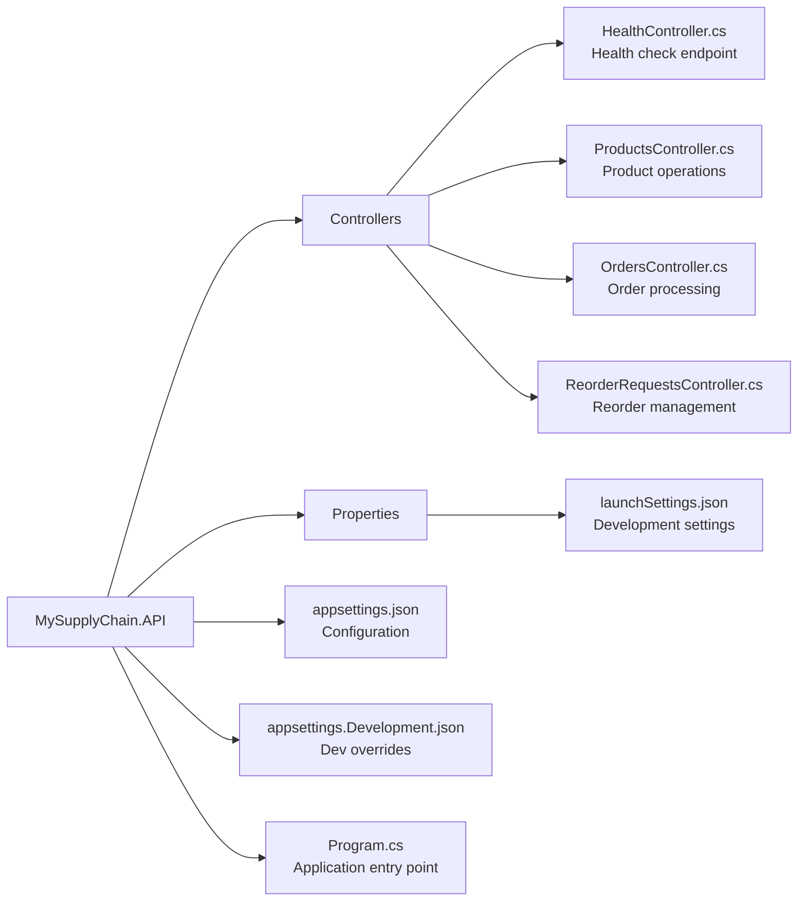

# MySupplyChain.API 🌐

> REST API layer built with ASP.NET Core providing HTTP endpoints for the supply chain system.

## Purpose

The API layer is the **entry point** for client applications. It's a thin layer that delegates all business logic to the Application layer via MediatR, following Clean Architecture principles.

## Structure



## API Endpoints

### Products API

#### GET /api/products

Get all products with health status.

**Response:**

```json
[
  {
    "id": 1,
    "name": "Dell Laptop",
    "sku": "DELL-L-001",
    "currentStock": 50,
    "reorderPoint": 10,
    "price": 1200.0,
    "healthStatus": "Healthy"
  }
]
```

#### POST /api/products

Create a new product.

**Request:**

```json
{
  "name": "HP Laptop",
  "sku": "HP-L-001",
  "currentStock": 25,
  "reorderPoint": 5,
  "price": 999.99
}
```

**Response:** `201 Created` with product ID

#### POST /api/products/{id}/restock

Increase product stock.

**Request:**

```json
{
  "productId": 1,
  "quantity": 20
}
```

**Response:**

```json
{
  "currentStock": 70,
  "message": "Product restocked successfully"
}
```

#### GET /api/products/{id}/forecast?daysToForecast=30

Get AI demand prediction for a product.

**Response:**

```json
{
  "productId": 1,
  "productName": "Dell Laptop",
  "predictedDemand": 45.3,
  "daysForecasted": 30,
  "confidence": "Medium"
}
```

### Orders API

#### POST /api/orders

Process a customer order.

**Request:**

```json
{
  "productId": 1,
  "quantity": 10
}
```

**Response:**

```json
{
  "newStockLevel": 40,
  "message": "Order processed successfully"
}
```

**Side Effects:**

- Reduces product stock
- Records sale in SalesHistory
- **Triggers AI reorder logic** if stock drops below reorder point

### Reorder Requests API

#### GET /api/reorder-requests

Get all reorder requests.

**Response:**

```json
[
  {
    "id": 1,
    "productId": 1,
    "productName": "Dell Laptop",
    "quantityToOrder": 75,
    "predictedDemand": 45.3,
    "status": "Pending",
    "requestedAt": "2024-01-15T10:30:00Z",
    "justification": "Stock (8) fell below reorder point (10). AI Forecast predicts demand of 45.3."
  }
]
```

### Health Check

#### GET /health

System health status.

**Response:**

```json
{
  "status": "Healthy",
  "timestamp": "2024-01-15T10:30:00Z"
}
```

## Controller Pattern

Controllers are **thin wrappers** that delegate to MediatR:

```csharp
[ApiController]
[Route("api/[controller]")]
public class ProductsController(
    IMediator mediator,
    ILogger<ProductsController> logger) : ControllerBase
{
    [HttpPost]
    public async Task<ActionResult<int>> CreateProduct(
        CreateProductCommand command)
    {
        logger.LogInformation("CreateProduct called for {Name}", command.Name);

        var productId = await mediator.Send(command);

        return CreatedAtAction(
            nameof(GetProductForecast),
            new { id = productId },
            productId);
    }

    [HttpGet("{id}/forecast")]
    public async Task<ActionResult<ProductForecastDto>> GetProductForecast(
        int id,
        [FromQuery] int daysToForecast = 30)
    {
        logger.LogInformation(
            "GetProductForecast called for ProductId={ProductId}", id);

        var query = new GetProductForecastQuery
        {
            ProductId = id,
            DaysToForecast = daysToForecast
        };

        var result = await mediator.Send(query);
        return Ok(result);
    }
}
```

**Key Principles:**

- ✅ No business logic in controllers
- ✅ Use MediatR for command/query execution
- ✅ Minimal logging for observability
- ✅ Return appropriate HTTP status codes

## Program.cs (Minimal API Setup)

```csharp
var builder = WebApplication.CreateBuilder(args);

// Add services
builder.Services.AddControllers();
builder.Services.AddEndpointsApiExplorer();
builder.Services.AddSwaggerGen();

// Register Application & Infrastructure layers
builder.Services.AddApplication();

// Skip Infrastructure in Testing environment
if (!builder.Environment.IsEnvironment("Testing"))
{
    builder.Services.AddInfrastructure(builder.Configuration);
}

var app = builder.Build();

// Configure pipeline
if (app.Environment.IsDevelopment())
{
    app.UseSwagger();
    app.UseSwaggerUI();
}

app.UseHttpsRedirection();
app.UseAuthorization();
app.MapControllers();
app.MapGet("/", () => Results.Redirect("/swagger"));

app.Run();

// Expose Program class for integration testing
public partial class Program { }
```

## Swagger/OpenAPI

The API automatically generates OpenAPI documentation accessible at `/swagger`.

**Features:**

- 📄 Interactive API documentation
- 🧪 Try-it-out functionality
- 📋 Request/response examples
- 🔍 Schema definitions

## Configuration

**appsettings.json:**

```json
{
  "Logging": {
    "LogLevel": {
      "Default": "Information",
      "Microsoft.AspNetCore": "Warning"
    }
  },
  "AllowedHosts": "*",
  "ConnectionStrings": {
    "DefaultConnection": "Server=(localdb)\\mssqllocaldb;Database=MySupplyChainDb;Trusted_Connection=true;"
  }
}
```

**appsettings.Development.json:**

```json
{
  "Logging": {
    "LogLevel": {
      "Default": "Debug"
    }
  }
}
```

## Running the API

```bash
# Development mode (with hot reload)
dotnet run

# Development mode with specific profile
dotnet run --launch-profile https

# Production build
dotnet build -c Release
dotnet run -c Release
```

**Typical console output:**

```
info: Microsoft.Hosting.Lifetime[14]
      Now listening on: https://localhost:5001
info: Microsoft.Hosting.Lifetime[14]
      Now listening on: http://localhost:5000
```

Access Swagger UI at: `https://localhost:5001/swagger`

## Dependencies

```xml
<PackageReference Include="Microsoft.AspNetCore.OpenApi" Version="9.0.*" />
<PackageReference Include="Swashbuckle.AspNetCore" Version="7.0.*" />
<PackageReference Include="MediatR" Version="12.*" />

<ProjectReference Include="..\MySupplyChain.Application\..." />
<ProjectReference Include="..\MySupplyChain.Infrastructure\..." />
```

## CORS (if needed)

To allow frontend apps to call the API:

```csharp
builder.Services.AddCors(options =>
{
    options.AddPolicy("AllowFrontend", policy =>
    {
        policy.WithOrigins("http://localhost:3000")
              .AllowAnyMethod()
              .AllowAnyHeader();
    });
});

// In pipeline
app.UseCors("AllowFrontend");
```

## Error Handling

Built-in ASP.NET Core error handling provides:

- **Development:** Detailed exception pages
- **Production:** Clean error responses
- **Model validation:** Automatic 400 Bad Request responses

Example validation error:

```json
{
  "type": "https://tools.ietf.org/html/rfc7231#section-6.5.1",
  "title": "One or more validation errors occurred.",
  "status": 400,
  "errors": {
    "Quantity": ["The Quantity field is required."]
  }
}
```

## Testing

Integration tests use `WebApplicationFactory`:

```csharp
var factory = new WebApplicationFactory<Program>()
    .WithWebHostBuilder(builder =>
    {
        builder.UseEnvironment("Testing");
        builder.ConfigureTestServices(services =>
        {
            // Replace SQL Server with InMemory DB
            // Mock ML forecaster
        });
    });

var client = factory.CreateClient();
var response = await client.GetAsync("/api/products");
```

See [MySupplyChain.Tests/API](../MySupplyChain.Tests/README.md#integration-tests).

## Best Practices

✅ **Do:**

- Keep controllers thin
- Use proper HTTP status codes
- Log important operations
- Return DTOs, not domain entities
- Use async/await consistently

❌ **Don't:**

- Put business logic in controllers
- Access the database directly
- Expose internal exception details to clients
- Return domain entities directly

---

**Related Documentation:**

- [Application Layer](../MySupplyChain.Application/README.md) - Command/Query handlers
- [Tests](../MySupplyChain.Tests/README.md) - Integration test examples
- [Root README](../README.md) - Getting started guide
