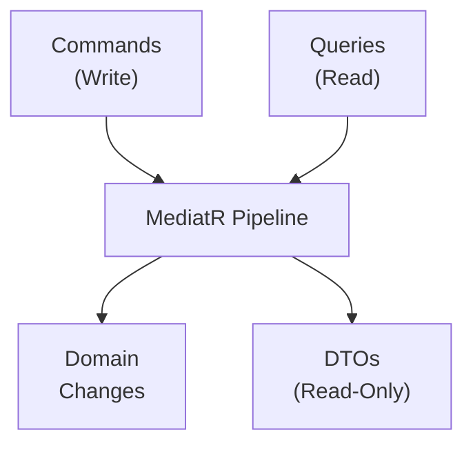
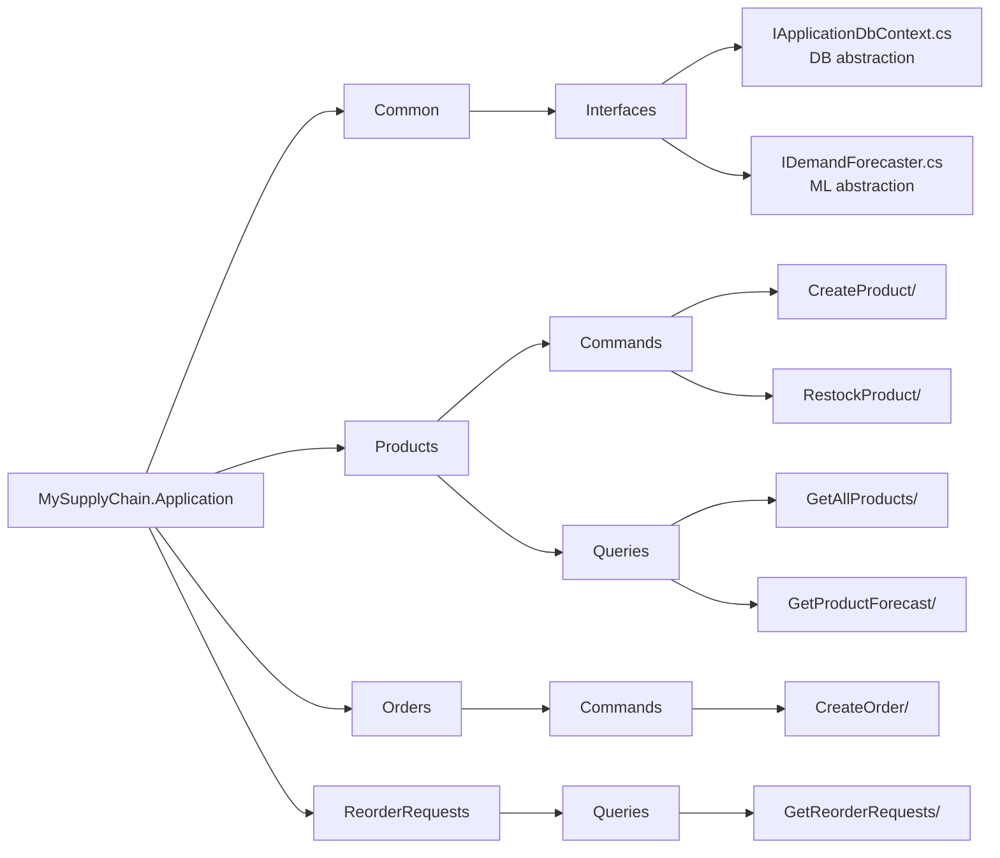

# MySupplyChain.Application ⚙️

> Business logic layer implementing CQRS pattern with MediatR.

## Purpose

The Application layer contains all **business logic** and orchestration. It uses the **CQRS** (Command Query Responsibility Segregation) pattern to separate read and write operations, making the codebase more maintainable and scalable.

## Architecture Pattern: CQRS



## Structure



## Commands vs Queries

### Commands (Write Operations)

Commands **change state** and return simple values (IDs, counts, etc.).

**Example: CreateOrderCommandHandler**

```csharp
public class CreateOrderCommandHandler(
    IApplicationDbContext context,
    IDemandForecaster forecaster)
    : IRequestHandler<CreateOrderCommand, int>
{
    public async Task<int> Handle(
        CreateOrderCommand request,
        CancellationToken cancellationToken)
    {
        // 1. Validate and reduce stock
        var product = await context.Products.FindAsync(request.ProductId);
        product.CurrentStock -= request.Quantity;

        // 2. Record the sale
        context.SalesHistories.Add(new SalesHistory { ... });
        await context.SaveChangesAsync();

        // 3. Check if reorder needed
        if (product.CurrentStock <= product.ReorderPoint)
        {
            await CreateReorderRequestAsync(product);
        }

        return product.CurrentStock;
    }
}
```

**Key Commands:**

- `CreateProductCommand` - Add new product to catalog
- `RestockProductCommand` - Increase product stock
- `CreateOrderCommand` - Process customer order (triggers AI logic)

### Queries (Read Operations)

Queries **read data** and return DTOs (Data Transfer Objects).

**Example: GetAllProductsHandler**

```csharp
public class GetAllProductsHandler(IApplicationDbContext context)
    : IRequestHandler<GetAllProductsQuery, List<ProductDto>>
{
    public async Task<List<ProductDto>> Handle(
        GetAllProductsQuery request,
        CancellationToken cancellationToken)
    {
        var products = await context.Products.ToListAsync();

        return products.Select(p => new ProductDto
        {
            Id = p.Id,
            Name = p.Name,
            CurrentStock = p.CurrentStock,
            HealthStatus = p.CurrentStock <= p.ReorderPoint
                ? "Low Stock" : "Healthy"
        }).ToList();
    }
}
```

**Key Queries:**

- `GetAllProductsQuery` - List all products with health status
- `GetProductForecastQuery` - Get AI demand prediction
- `GetReorderRequestsQuery` - List pending reorder requests

## Interfaces

### IApplicationDbContext

Abstracts the database, allowing the Application layer to remain independent of EF Core.

```csharp
public interface IApplicationDbContext
{
    DbSet<Product> Products { get; }
    DbSet<SalesHistory> SalesHistories { get; }
    DbSet<ReorderRequest> ReorderRequests { get; }

    Task<int> SaveChangesAsync(CancellationToken cancellationToken = default);
}
```

**Why Interface?**

- **Testability:** Can mock in unit tests
- **Flexibility:** Can swap implementations without changing logic
- **Clean Architecture:** Application doesn't depend on Infrastructure

### IDemandForecaster

Abstracts ML.NET forecasting logic.

```csharp
public interface IDemandForecaster
{
    Task<float> PredictDemandAsync(
        int productId,
        IEnumerable<float> historicalSales);
}
```

## DTOs (Data Transfer Objects)

DTOs are read-only models returned to the API layer.

**ProductDto:**

```csharp
public class ProductDto
{
    public int Id { get; set; }
    public string Name { get; set; }
    public int CurrentStock { get; set; }
    public int ReorderPoint { get; set; }
    public string HealthStatus { get; set; }  // Computed field
}
```

**Why DTOs?**

- Don't expose internal domain entities directly
- Include computed fields (like HealthStatus)
- Control exactly what data is returned

## Dependency Injection

Register MediatR and handlers:

```csharp
public static class DependencyInjection
{
    public static IServiceCollection AddApplication(
        this IServiceCollection services)
    {
        services.AddMediatR(cfg =>
            cfg.RegisterServicesFromAssembly(
                Assembly.GetExecutingAssembly()));

        return services;
    }
}
```

Used in `Program.cs`:

```csharp
builder.Services.AddApplication();
```

## Key Features

### 🤖 AI Integration

The `CreateOrderCommandHandler` triggers AI forecasting:

1. Customer places order
2. Stock is reduced
3. If `CurrentStock <= ReorderPoint`:
   - Calls `IDemandForecaster.PredictDemandAsync()`
   - Creates `ReorderRequest` with AI justification
   - Saves to database

### 🔒 Validation

Each command can include validation logic:

- Stock availability checks
- Quantity validations
- Business rule enforcement

### 🎯 Single Responsibility

Each handler does **one thing**:

- `CreateOrderCommandHandler` - Process orders
- `RestockProductCommandHandler` - Update stock
- `GetProductForecastHandler` - Return prediction

## Dependencies

```xml
<PackageReference Include="MediatR" Version="12.*" />
<PackageReference Include="Microsoft.EntityFrameworkCore" Version="9.0.*" />

<ProjectReference Include="..\MySupplyChain.Domain\..." />
```

## Testing

Application handlers are easily testable with mocked interfaces:

```csharp
var contextMock = new Mock<IApplicationDbContext>();
var forecasterMock = new Mock<IDemandForecaster>();

var handler = new CreateOrderCommandHandler(
    contextMock.Object,
    forecasterMock.Object);
```

See [MySupplyChain.Tests](../MySupplyChain.Tests/README.md) for examples.

## Best Practices

✅ **Do:**

- Keep handlers focused on single operations
- Use interfaces for external dependencies
- Return DTOs from queries
- Use CancellationToken for async operations

❌ **Don't:**

- Access database directly (use IApplicationDbContext)
- Return domain entities from queries
- Put business logic in API controllers

---

**Related Documentation:**

- [Domain Layer](../MySupplyChain.Domain/README.md) - Entities used by handlers
- [Infrastructure Layer](../MySupplyChain.Infrastructure/README.md) - Implements interfaces
- [API Layer](../MySupplyChain.API/README.md) - Calls handlers via MediatR
- [Tests](../MySupplyChain.Tests/README.md) - Unit tests for handlers
