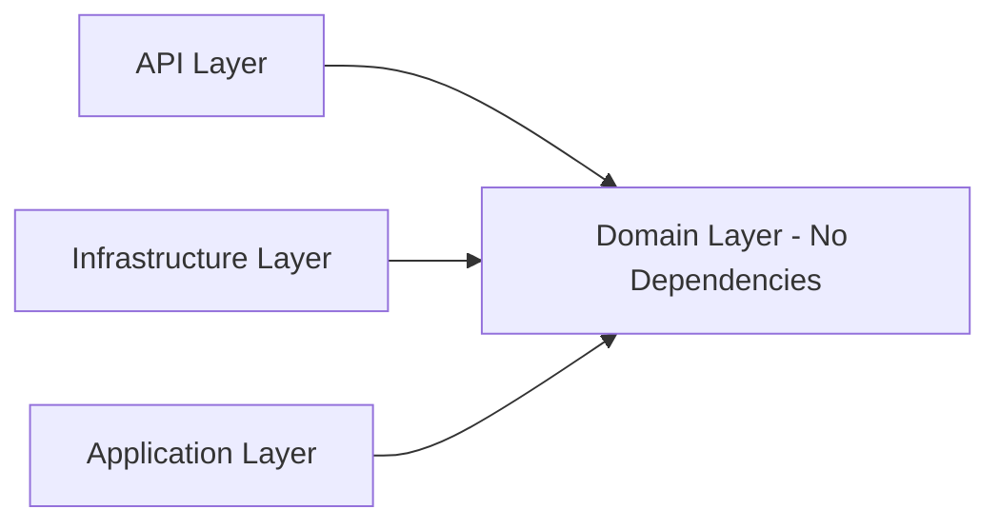
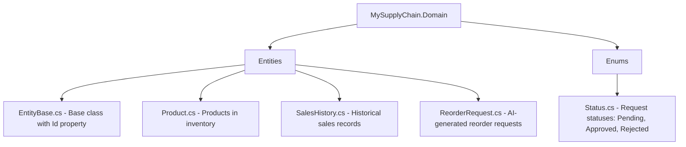

# MySupplyChain.Domain 📦

> The core business layer containing domain entities and business rules.

## Purpose

The Domain layer is the **heart** of the application. It contains the business entities and represents the core concepts of the supply chain domain. This layer has **zero dependencies** on other projects - it's completely independent.

## Key Concepts

### Clean Architecture Principle

The Domain layer sits at the center of Clean Architecture. All other layers depend on it, but it depends on nothing.



## Structure


## Entities

### Product

Represents items in the inventory system.

```csharp
public class Product : EntityBase
{
    public string Name { get; set; }           // Product name
    public string Sku { get; set; }            // Stock Keeping Unit
    public int CurrentStock { get; set; }      // Available quantity
    public int ReorderPoint { get; set; }      // Trigger for reordering
    public decimal Price { get; set; }         // Unit price

    // Navigation property for ML forecasting
    public List<SalesHistory> SalesHistory { get; set; }
}
```

**Business Rules:**

- SKU must be unique
- ReorderPoint determines when automatic reordering triggers
- CurrentStock is updated when orders are placed

### SalesHistory

Tracks historical sales data used for AI demand forecasting.

```csharp
public class SalesHistory : EntityBase
{
    public int ProductId { get; set; }         // Foreign key
    public DateTime Date { get; set; }         // Sale date
    public int QuantitySold { get; set; }      // Quantity sold

    // Navigation property
    public Product Product { get; set; }
}
```

**Purpose:**

- Provides training data for ML.NET model
- Enables trend analysis and prediction

### ReorderRequest

AI-generated requests to restock inventory.

```csharp
public class ReorderRequest : EntityBase
{
    public int ProductId { get; set; }         // What to order
    public int QuantityToOrder { get; set; }   // How much
    public decimal PredictedDemand { get; set; }  // AI forecast
    public DateTime RequestedAt { get; set; }  // When created
    public Status Status { get; set; }         // Pending/Approved/Rejected
    public string Justification { get; set; }  // AI explanation

    // Navigation property
    public Product Product { get; set; }
}
```

**Business Logic:**

- Automatically created when stock drops below ReorderPoint
- Justification includes AI prediction for informed decision-making
- Status workflow: Pending → Approved/Rejected

## Enums

### Status

```csharp
public enum Status
{
    Pending = 0,
    Approved = 1,
    Rejected = 2
}
```

Used to track the lifecycle of reorder requests.

## Design Principles

1. **Persistence Ignorance:** Entities don't know about databases
2. **Framework Independence:** No external dependencies
3. **Pure C#:** Only domain logic, no infrastructure concerns
4. **Single Responsibility:** Each entity represents one business concept

## Dependencies

**None!** This is intentional. The Domain layer should be completely independent.

```xml
<Project Sdk="Microsoft.NET.Sdk">
  <PropertyGroup>
    <TargetFramework>net9.0</TargetFramework>
  </PropertyGroup>
  <!-- No package references -->
</Project>
```

## Usage in Other Layers

Other layers reference and use Domain entities:

- **Application:** Manipulates entities in command/query handlers
- **Infrastructure:** Maps entities to database tables via EF Core
- **API:** Returns entities (or DTOs based on entities) in responses

## Best Practices

✅ **Do:**

- Keep entities simple (POCOs - Plain Old C# Objects)
- Add validation in entity constructors if needed
- Use navigation properties for relationships

❌ **Don't:**

- Add database annotations (use Fluent API in Infrastructure instead)
- Reference other projects
- Include infrastructure concerns (logging, HTTP, etc.)

---

**Related Documentation:**

- [Application Layer](../MySupplyChain.Application/README.md) - Uses these entities
- [Infrastructure Layer](../MySupplyChain.Infrastructure/README.md) - Persists these entities
- [Root README](../README.md) - Overall architecture
