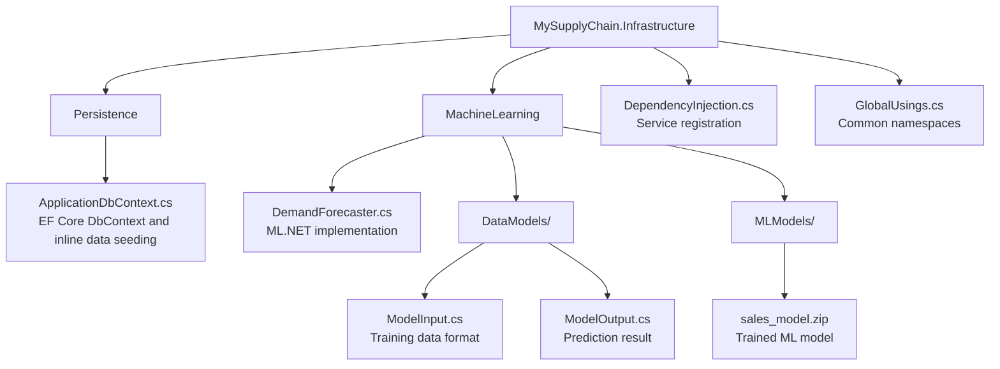

# MySupplyChain.Infrastructure 🔧

> External concerns layer implementing database persistence and ML.NET forecasting.

## Purpose

The Infrastructure layer handles all **external dependencies** like databases, file systems, and machine learning models. It implements the interfaces defined in the Application layer, keeping business logic decoupled from technical implementation details.

## Structure



## Key Components

### 1. Database (EF Core)

#### ApplicationDbContext

Implements `IApplicationDbContext` interface from Application layer.

```csharp
public class ApplicationDbContext : DbContext, IApplicationDbContext
{
    public ApplicationDbContext(DbContextOptions<ApplicationDbContext> options)
        : base(options) { }

    public DbSet<Product> Products => Set<Product>();
    public DbSet<SalesHistory> SalesHistories => Set<SalesHistory>();
    public DbSet<ReorderRequest> ReorderRequests => Set<ReorderRequest>();

    protected override void OnModelCreating(ModelBuilder modelBuilder)
    {
        modelBuilder.ApplyConfigurationsFromAssembly(
            Assembly.GetExecutingAssembly());
    }
}
```

#### Fluent API Configurations & Data Seeding

Instead of Data Annotations or separate config classes, we use Fluent API efficiently mixed directly into `OnModelCreating`, along with `HasData` for deterministic seeding to ensure the ML model can train deterministically.

```csharp
    protected override void OnModelCreating(ModelBuilder modelBuilder)
    {
        base.OnModelCreating(modelBuilder);

        // Configure Product entity
        modelBuilder.Entity<Product>(entity =>
        {
            entity.HasKey(e => e.Id);
            entity.Property(e => e.Name).IsRequired().HasMaxLength(200);
            entity.Property(e => e.Price).HasPrecision(18, 2);
        });

        // SEED DATA
        var staticDate = new DateTime(2024, 1, 1, 0, 0, 0, DateTimeKind.Utc);

        modelBuilder.Entity<Product>().HasData(
            new Product { Id = 1, Name = "Laptop Dell XPS 13", Sku = "DELL-XPS-001", /* ... */ }
        );
        
        // Identity Role data is also seeded safely
    }
```

**Why Fluent API?**

- Keeps Domain entities clean (no database attributes)
- Centralizes database structure in `OnModelCreating`
- Hardcoded test data enables `HasData` logic to seed predictably on new environments

### 2. Machine Learning (ML.NET)

#### DemandForecaster

Implements `IDemandForecaster` interface.

```csharp
public class DemandForecaster : IDemandForecaster
{
    private readonly MLContext _mlContext;
    private readonly ITransformer? _model;
    private readonly ILogger<DemandForecaster> _logger;

    public DemandForecaster(string modelPath, ILogger<DemandForecaster> logger)
    {
        _mlContext = new MLContext(seed: 0);
        _logger = logger;

        if (File.Exists(modelPath))
        {
            _model = _mlContext.Model.Load(modelPath, out _);
            _logger.LogInformation("ML model loaded: {ModelFile}",
                Path.GetFileName(modelPath));
        }
        else
        {
            _logger.LogWarning("No ML model found at: {ModelPath}", modelPath);
        }
    }

    public Task<float> PredictDemandAsync(
        int productId,
        string sku,
        IEnumerable<float> historicalSales)
    {
        var salesList = historicalSales.ToList();

        // Fallback: use simple average if model not trained yet
        if (_model == null)
        {
            var avg = salesList.Count != 0 ? salesList.Average() : 0f;
            _logger.LogWarning("Model not loaded. Returning average: {Avg}", avg);
            return Task.FromResult(avg);
        }

        try
        {
            var predictionEngine = _mlContext.Model
                .CreatePredictionEngine<ModelInput, ModelOutput>(_model);

            var avgSales = salesList.Take(30).Average();
            var input = new ModelInput
            {
                ProductId = productId,
                Sku = sku,
                QuantitySold = avgSales,
                Price = 0,
                DayOfWeek = (int)DateTime.Now.DayOfWeek,
                Month = DateTime.Now.Month,
                Date = DateTime.Now.ToString("yyyy-MM-dd")
            };

            var prediction = predictionEngine.Predict(input);
            return Task.FromResult(prediction.PredictedDemand);
        }
        catch (Exception ex)
        {
            _logger.LogError(ex, "Prediction failed for product {ProductId}", productId);
            // Fallback to average
            return Task.FromResult(salesList.Average());
        }
    }
}
```

**Key Features:**

- ✅ Graceful fallback when model not available
- ✅ Logging for observability
- ✅ Error handling with fallback logic

#### ML Data Models

**ModelInput.cs** (What goes INTO the model):

```csharp
public class ModelInput
{
    [LoadColumn(0)]
    public float ProductId { get; set; }

    [LoadColumn(1)]
    public string Sku { get; set; } = string.Empty;

    [LoadColumn(2)]
    public string Date { get; set; } = string.Empty;

    [LoadColumn(3)]
    public float QuantitySold { get; set; }

    [LoadColumn(4)]
    public float Price { get; set; }

    [LoadColumn(5)]
    public float DayOfWeek { get; set; }

    [LoadColumn(6)]
    public float Month { get; set; }
}
```

**ModelOutput.cs** (What comes OUT of the model):

```csharp
public class ModelOutput
{
    [ColumnName("Score")]
    public float PredictedDemand { get; set; }
}
```

## Dependency Injection

Register Infrastructure services in the API:

```csharp
public static class DependencyInjection
{
    public static IServiceCollection AddInfrastructure(
        this IServiceCollection services,
        IConfiguration configuration)
    {
        // Register EF Core with SQL Server
        services.AddDbContext<ApplicationDbContext>(options =>
            options.UseSqlServer(
                configuration.GetConnectionString("DefaultConnection")));

        // Register DbContext interface
        services.AddScoped<IApplicationDbContext>(provider =>
            provider.GetRequiredService<ApplicationDbContext>());

        // Register ML.NET Demand Forecaster
        var modelPath = Path.Combine(
            AppDomain.CurrentDomain.BaseDirectory,
            "MLModels",
            "sales_model.zip");

        services.AddSingleton<IDemandForecaster>(provider =>
        {
            var logger = provider.GetRequiredService<ILogger<DemandForecaster>>();
            return new DemandForecaster(modelPath, logger);
        });

        return services;
    }
}
```

## Database Migrations

**Creating Migrations:**

```bash
# From Infrastructure directory
dotnet ef migrations add InitialCreate -s ../MySupplyChain.API

# Apply migrations
dotnet ef database update -s ../MySupplyChain.API
```

**Note:** `-s` flag specifies the startup project (API).

## Configuration

**appsettings.json in API project:**

```json
{
  "ConnectionStrings": {
    "DefaultConnection": "Server=(localdb)\\mssqllocaldb;Database=MySupplyChainDb;Trusted_Connection=true;"
  }
}
```

## Dependencies

```xml
<PackageReference Include="Microsoft.EntityFrameworkCore" Version="9.0.*" />
<PackageReference Include="Microsoft.EntityFrameworkCore.SqlServer" Version="9.0.*" />
<PackageReference Include="Microsoft.EntityFrameworkCore.Tools" Version="9.0.*" />
<PackageReference Include="Microsoft.ML" Version="3.0.*" />

<ProjectReference Include="..\MySupplyChain.Domain\..." />
<ProjectReference Include="..\MySupplyChain.Application\..." />
```

## Testing

For testing, Infrastructure can be swapped:

- Use **InMemory database** instead of SQL Server
- Use **mock forecaster** instead of real ML model

See [MySupplyChain.Tests](../MySupplyChain.Tests/README.md) for examples.

## Best Practices

✅ **Do:**

- Use Fluent API for all EF configurations
- Implement proper error handling in external services
- Provide fallback logic for ML predictions
- Use dependency injection for flexibility

❌ **Don't:**

- Put business logic in Infrastructure
- Use Data Annotations on Domain entities
- Hardcode file paths or connection strings

---

**Related Documentation:**

- [Application Layer](../MySupplyChain.Application/README.md) - Defines interfaces we implement
- [ModelTrainer](../MySupplyChain.ModelTrainer/README.md) - Generates the ML model
- [Root README](../README.md) - Getting started with database setup
