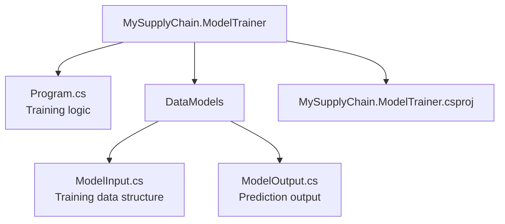

# MySupplyChain.ModelTrainer 🤖

> Console application for training the ML.NET demand forecasting model.

## Purpose

The ModelTrainer is a **separate utility** that trains the ML.NET model using historical sales data. It must be run **before** the API starts to generate the `sales_model.zip` file that the Infrastructure layer loads.

## Structure



## What It Does

1. **Generates synthetic training data** (30 days of sales for 3 products)
2. **Trains an ML.NET regression model** using Fast Tree algorithm
3. **Saves the trained model** to `MySupplyChain.Infrastructure/MLModels/sales_model.zip`
4. **Provides metrics** to verify model quality

## Training Process

### Program.cs Overview

```csharp
var mlContext = new MLContext(seed: 0);

// 1. Generate or load training data
var trainingData = GenerateSyntheticData();

// 2. Load data into ML.NET format
var dataView = mlContext.Data.LoadFromEnumerable(trainingData);

// 3. Define ML pipeline
var pipeline = mlContext.Transforms.CopyColumns("Label", "QuantitySold")
    .Append(mlContext.Transforms.Concatenate("Features",
        "ProductId", "DayOfWeek", "Month", "Price"))
    .Append(mlContext.Regression.Trainers.FastTree(
        labelColumnName: "Label",
        featureColumnName: "Features"));

// 4. Train the model
var model = pipeline.Fit(dataView);

// 5. Evaluate model quality
var predictions = model.Transform(dataView);
var metrics = mlContext.Regression.Evaluate(predictions, "Label");

Console.WriteLine($"R-Squared: {metrics.RSquared:F2}");
Console.WriteLine($"MAE: {metrics.MeanAbsoluteError:F2}");

// 6. Save model to Infrastructure project
var outputPath = Path.Combine(
    basePath,
    "MySupplyChain.Infrastructure",
    "MLModels",
    "sales_model.zip");

mlContext.Model.Save(model, dataView.Schema, outputPath);
```

### Synthetic Data Generation

Creates realistic sales patterns:

```csharp
private static List<ModelInput> GenerateSyntheticData()
{
    var data = new List<ModelInput>();
    var random = new Random(42);
    var productIds = new[] { 1, 2, 3 };
    var productPrices = new Dictionary<int, float>
    {
        { 1, 1200f },  // Dell Laptop
        { 2, 800f },   // HP Printer
        { 3, 50f }     // Logitech Mouse
    };

    // Generate 30 days of data for each product
    for (int day = 0; day < 30; day++)
    {
        var date = DateTime.Now.AddDays(-30 + day);

        foreach (var productId in productIds)
        {
            // Simulate varying demand
            float baseDemand = productId switch
            {
                1 => 10f,  // Laptops: moderate demand
                2 => 5f,   // Printers: lower demand
                3 => 30f,  // Mice: high demand
                _ => 10f
            };

            // Add randomness and weekend boost
            float quantity = baseDemand;
            quantity += random.Next(-3, 7);
            if (date.DayOfWeek == DayOfWeek.Saturday ||
                date.DayOfWeek == DayOfWeek.Sunday)
            {
                quantity *= 1.3f;  // Weekend boost
            }

            data.Add(new ModelInput
            {
                Date = date.ToString("yyyy-MM-dd"),
                ProductId = productId,
                QuantitySold = Math.Max(0, quantity),
                DayOfWeek = (int)date.DayOfWeek,
                Month = date.Month,
                Price = productPrices[productId]
            });
        }
    }

    return data;
}
```

## ML Pipeline Explained

### 1. Feature Engineering

```csharp
mlContext.Transforms.CopyColumns("Label", "QuantitySold")
```

- Copies `QuantitySold` to `Label` (what we're predicting)

```csharp
mlContext.Transforms.Concatenate("Features",
    "ProductId", "DayOfWeek", "Month", "Price")
```

- Combines input features into single vector

### 2. Regression Algorithm

```csharp
mlContext.Regression.Trainers.FastTree(
    labelColumnName: "Label",
    featureColumnName: "Features")
```

**Fast Tree** is a decision tree-based algorithm:

- ✅ Fast training
- ✅ Good for tabular data
- ✅ Handles non-linear relationships

### 3. Model Evaluation

Metrics printed to console:

- **R-Squared (R²):** How well model fits data (0-1, higher is better)
- **Mean Absolute Error (MAE):** Average prediction error
- **Root Mean Squared Error (RMSE):** Prediction accuracy

Example output:

```
Model training complete!
R-Squared: 0.85
MAE: 3.24
RMSE: 4.51
Model saved to: E:\MySupplyChain\MySupplyChain.Infrastructure\MLModels\sales_model.zip
```

## Running the Trainer

```bash
cd MySupplyChain.ModelTrainer
dotnet run
```

**When to run:**

- ✅ Before first API launch
- ✅ After adding new products
- ✅ Periodically with real data (weekly/monthly)

## Data Models

### ModelInput

```csharp
public class ModelInput
{
    [LoadColumn(0)]
    public string Date { get; set; } = string.Empty;

    [LoadColumn(1)]
    public int ProductId { get; set; }

    [LoadColumn(2)]
    public float QuantitySold { get; set; }

    [LoadColumn(3)]
    public int DayOfWeek { get; set; }

    [LoadColumn(4)]
    public int Month { get; set; }

    [LoadColumn(5)]
    public float Price { get; set; }
}
```

**Features used for training:**

- `ProductId` - Which product
- `DayOfWeek` - Seasonal patterns
- `Month` - Monthly trends
- `Price` - Price impact on demand

**Label (target):**

- `QuantitySold` - What we're predicting

### ModelOutput

```csharp
public class ModelOutput
{
    [ColumnName("Score")]
    public float PredictedDemand { get; set; }
}
```

## Improving the Model

### Using Real Data

Replace synthetic data with real sales:

```csharp
// Load from database
using var context = new ApplicationDbContext(options);
var salesData = context.SalesHistories
    .Select(s => new ModelInput
    {
        Date = s.Date.ToString("yyyy-MM-dd"),
        ProductId = s.ProductId,
        QuantitySold = s.QuantitySold,
        DayOfWeek = (int)s.Date.DayOfWeek,
        Month = s.Date.Month,
        Price = s.Product.Price
    })
    .ToList();
```

### Adding Features

Consider adding:

- `IsHoliday` - Special event indicator
- `PromotionActive` - Sales/discounts
- `InventoryLevel` - Stock availability
- `CompetitorPrice` - Market conditions

### Trying Different Algorithms

ML.NET provides alternatives:

```csharp
// Linear regression (faster, simpler)
mlContext.Regression.Trainers.Sdca()

// Light GBM (more accurate, slower)
mlContext.Regression.Trainers.LightGbm()

// Online gradient descent (for streaming data)
mlContext.Regression.Trainers.OnlineGradientDescent()
```

## Dependencies

```xml
<PackageReference Include="Microsoft.ML" Version="3.0.*" />

<ProjectReference Include="..\MySupplyChain.Infrastructure\..." />
```

**Note:** References Infrastructure to access `DataModels` and save location.

## Troubleshooting

### Model Not Found Error in API

```
No ML model found at: MLModels/sales_model.zip
```

**Solution:** Run the ModelTrainer first:

```bash
cd MySupplyChain.ModelTrainer
dotnet run
```

### Poor Predictions

If predictions are inaccurate:

1. **Check metrics:** R² should be > 0.7
2. **Add more data:** 30 days might not be enough
3. **Add features:** Include more factors affecting demand
4. **Try different algorithms:** FastTree vs LightGBM

### File Path Issues

Ensure output path is correct:

```csharp
var basePath = Directory.GetParent(
    AppDomain.CurrentDomain.BaseDirectory)!
    .Parent!.Parent!.Parent!.Parent!.FullName;
```

This navigates from `bin/Debug/net9.0/` back to solution root.

## Best Practices

✅ **Do:**

- Run trainer before deploying to production
- Retrain periodically with fresh data
- Monitor model metrics over time
- Version your models (e.g., `sales_model_v2.zip`)

❌ **Don't:**

- Use synthetic data in production long-term
- Ignore model evaluation metrics
- Train with too little data (< 100 records)

---

**Related Documentation:**

- [Infrastructure Layer](../MySupplyChain.Infrastructure/README.md) - Uses the trained model
- [Root README](../README.md) - Getting started instructions
