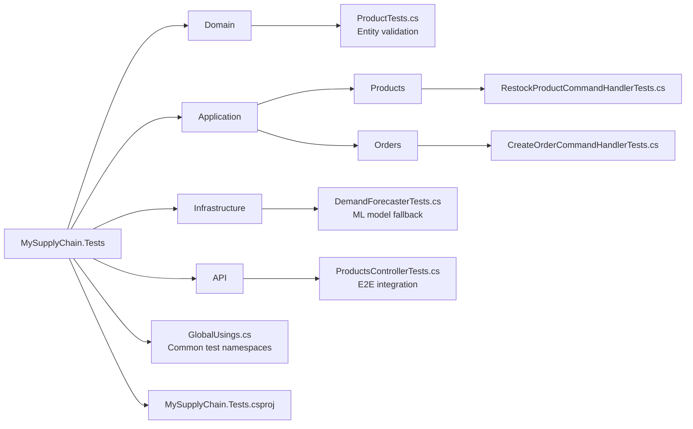

# MySupplyChain.Tests 🧪

> Comprehensive test suite covering all application layers with 12 passing tests.

## Purpose

The test project ensures code quality and correctness across all layers using **unit tests**, **integration tests**, and **mocking**. It follows the same Clean Architecture structure as the main application.

## Test Statistics

```
✅ Total Tests: 12 passing
├── Domain Tests: 1
├── Application Tests: 6
├── Infrastructure Tests: 2
└── Integration Tests: 3
```

## Structure



## Running Tests

### All Tests

```bash
dotnet test
```

### With Detailed Output

```bash
dotnet test --logger "console;verbosity=detailed"
```

### Specific Project

```bash
cd MySupplyChain.Tests
dotnet test
```

### With Coverage (if configured)

```bash
dotnet test /p:CollectCoverage=true
```

## Test Categories

### 1. Domain Tests

**ProductTests.cs** - Validates domain entities.

```csharp
[Fact]
public void NewProduct_ShouldHaveDefaultValues()
{
    // Arrange & Act
    var product = new Product();

    // Assert
    product.CurrentStock.Should().Be(0);
    product.SalesHistory.Should().BeEmpty();
}
```

**What's Tested:**

- ✅ Default property values
- ✅ Entity initialization

### 2. Application Tests (Unit Tests with Mocking)

#### RestockProductCommandHandlerTests.cs

Tests the restock command handler with mocked dependencies.

```csharp
[Fact]
public async Task Handle_ShouldIncreaseStock_WhenProductExists()
{
    // Arrange
    var contextMock = new Mock<IApplicationDbContext>();
    var productsMock = new Mock<DbSet<Product>>();

    var product = new Product { Id = 1, CurrentStock = 10 };
    productsMock.Setup(m => m.FindAsync(new object[] { 1 },
        It.IsAny<CancellationToken>()))
        .ReturnsAsync(product);

    contextMock.Setup(c => c.Products).Returns(productsMock.Object);

    var handler = new RestockProductCommandHandler(contextMock.Object);
    var command = new RestockProductCommand(1, 5);

    // Act
    var result = await handler.Handle(command, CancellationToken.None);

    // Assert
    result.Should().Be(15);
    product.CurrentStock.Should().Be(15);
    contextMock.Verify(m => m.SaveChangesAsync(It.IsAny<CancellationToken>()),
        Times.Once);
}
```

**What's Tested:**

- ✅ Stock increase with valid quantity
- ✅ KeyNotFoundException for missing products
- ✅ Database save called exactly once

#### CreateOrderCommandHandlerTests.cs

Tests order processing and automatic reordering with **InMemory database**.

```csharp
[Fact]
public async Task Handle_ShouldCreateReorderRequest_WhenStockFallsBelowThreshold()
{
    // Arrange
    var options = new DbContextOptionsBuilder<ApplicationDbContext>()
        .UseInMemoryDatabase(databaseName: Guid.NewGuid().ToString())
        .Options;

    var context = new ApplicationDbContext(options);
    var forecasterMock = new Mock<IDemandForecaster>();

    forecasterMock.Setup(f => f.PredictDemandAsync(
            It.IsAny<int>(),
            It.IsAny<List<float>>()))
        .ReturnsAsync(50f);

    var product = new Product
    {
        Id = 2,
        CurrentStock = 15,
        ReorderPoint = 10
    };
    context.Products.Add(product);
    await context.SaveChangesAsync();

    var handler = new CreateOrderCommandHandler(context, forecasterMock.Object);

    // Act - Order 10 items, stock becomes 5 (< threshold)
    await handler.Handle(new CreateOrderCommand(2, 10), CancellationToken.None);

    // Assert
    var reorder = await context.ReorderRequests
        .FirstOrDefaultAsync(r => r.ProductId == 2);

    reorder.Should().NotBeNull();
    reorder.Status.Should().Be(Status.Pending);
    reorder.QuantityToOrder.Should().BeGreaterThan(0);
}
```

**What's Tested:**

- ✅ Stock reduction when order placed
- ✅ Automatic reorder request creation
- ✅ Exception thrown for insufficient stock
- ✅ AI forecaster integration

### 3. Infrastructure Tests

**DemandForecasterTests.cs** - Tests ML model fallback logic.

```csharp
[Fact]
public async Task PredictDemandAsync_ShouldReturnAverage_WhenModelNotLoaded()
{
    // Arrange
    var loggerMock = new Mock<ILogger<DemandForecaster>>();
    var forecaster = new DemandForecaster("non_existent_model.zip",
        loggerMock.Object);
    var history = new List<float> { 10, 20, 30 }; // Avg = 20

    // Act
    var result = await forecaster.PredictDemandAsync(1, history);

    // Assert
    result.Should().Be(20);
}

[Fact]
public async Task PredictDemandAsync_ShouldReturnZero_WhenHistoryEmpty()
{
    // Arrange
    var loggerMock = new Mock<ILogger<DemandForecaster>>();
    var forecaster = new DemandForecaster("non_existent_model.zip",
        loggerMock.Object);

    // Act
    var result = await forecaster.PredictDemandAsync(1, Enumerable.Empty<float>());

    // Assert
    result.Should().Be(0);
}
```

**What's Tested:**

- ✅ Graceful fallback when ML model not available
- ✅ Correct average calculation
- ✅ Edge case handling (empty data)

### 4. Integration Tests (API)

**ProductsControllerTests.cs** - Full end-to-end workflow.

```csharp
public class ProductsControllerTests : IClassFixture<WebApplicationFactory<Program>>
{
    private readonly WebApplicationFactory<Program> _factory;

    public ProductsControllerTests(WebApplicationFactory<Program> factory)
    {
        _factory = factory.WithWebHostBuilder(builder =>
        {
            // Use Testing environment to skip SQL Server
            builder.UseEnvironment("Testing");

            builder.ConfigureTestServices(services =>
            {
                // Register InMemory database
                var dbName = "TestDb_" + Guid.NewGuid();
                services.AddDbContext<ApplicationDbContext>(options =>
                    options.UseInMemoryDatabase(dbName));

                services.AddScoped<IApplicationDbContext>(provider =>
                    provider.GetRequiredService<ApplicationDbContext>());

                // Register Mock Forecaster
                var forecasterMock = new Mock<IDemandForecaster>();
                forecasterMock.Setup(f => f.PredictDemandAsync(
                        It.IsAny<int>(),
                        It.IsAny<IEnumerable<float>>()))
                    .ReturnsAsync(50f);
                services.AddSingleton(forecasterMock.Object);
            });
        });
    }

    [Fact]
    public async Task CreateAndRestockProduct_ShouldUpdateStock()
    {
        var client = _factory.CreateClient();

        // 1. Create Product
        var createCommand = new CreateProductCommand
        {
            Name = "Test Product",
            Sku = "TEST-001",
            Price = 100m,
            CurrentStock = 100,
            ReorderPoint = 10
        };
        var createResponse = await client.PostAsJsonAsync("/api/products",
            createCommand);
        var productId = await createResponse.Content.ReadFromJsonAsync<int>();

        // 2. Verify product created
        var getResponse = await client.GetAsync("/api/products");
        var products = await getResponse.Content
            .ReadFromJsonAsync<List<ProductDto>>();
        products.Should().Contain(p => p.Id == productId);

        // 3. Restock product
        var restockCommand = new RestockProductCommand(productId, 50);
        await client.PostAsJsonAsync($"/api/products/{productId}/restock",
            restockCommand);

        // 4. Verify stock updated
        var finalProducts = await (await client.GetAsync("/api/products"))
            .Content.ReadFromJsonAsync<List<ProductDto>>();
        var product = finalProducts!.First(p => p.Id == productId);

        product.CurrentStock.Should().Be(150); // 100 + 50
    }
}
```

**What's Tested:**

- ✅ Full HTTP request/response cycle
- ✅ Create → Read → Update workflow
- ✅ API endpoints integration
- ✅ JSON serialization/deserialization

## Testing Tools

### xUnit

Primary testing framework with `[Fact]` and `[Theory]` attributes.

### Moq

Mocking framework for interfaces:

```csharp
var mock = new Mock<IApplicationDbContext>();
mock.Setup(x => x.SaveChangesAsync(It.IsAny<CancellationToken>()))
    .ReturnsAsync(1);
```

### FluentAssertions

Readable assertions:

```csharp
result.Should().Be(15);
product.Should().NotBeNull();
products.Should().HaveCount(3);
```

### WebApplicationFactory

Integration testing for ASP.NET Core:

```csharp
var factory = new WebApplicationFactory<Program>();
var client = factory.CreateClient();
```

### EF Core InMemory

In-memory database for testing:

```csharp
var options = new DbContextOptionsBuilder<ApplicationDbContext>()
    .UseInMemoryDatabase("TestDb")
    .Options;
```

## Configuration

**MySupplyChain.Tests.csproj:**

```xml
<Project Sdk="Microsoft.NET.Sdk">
  <PropertyGroup>
    <TargetFramework>net9.0</TargetFramework>
  </PropertyGroup>

  <ItemGroup>
    <PackageReference Include="xunit" Version="2.9.*" />
    <PackageReference Include="xunit.runner.visualstudio" Version="3.1.*" />
    <PackageReference Include="Moq" Version="4.20.*" />
    <PackageReference Include="FluentAssertions" Version="8.0.*" />
    <PackageReference Include="Microsoft.AspNetCore.Mvc.Testing" Version="9.0.*" />
    <PackageReference Include="Microsoft.EntityFrameworkCore.InMemory" Version="9.0.*" />
  </ItemGroup>

  <ItemGroup>
    <ProjectReference Include="..\MySupplyChain.Domain\..." />
    <ProjectReference Include="..\MySupplyChain.Application\..." />
    <ProjectReference Include="..\MySupplyChain.Infrastructure\..." />
    <ProjectReference Include="..\MySupplyChain.API\..." />
  </ItemGroup>
</Project>
```

## Key Testing Patterns

### AAA Pattern (Arrange-Act-Assert)

```csharp
[Fact]
public void Test_Method()
{
    // Arrange - Set up test data
    var product = new Product { CurrentStock = 10 };

    // Act - Execute the operation
    product.CurrentStock += 5;

    // Assert - Verify the result
    product.CurrentStock.Should().Be(15);
}
```

### Mocking Dependencies

```csharp
var mock = new Mock<IApplicationDbContext>();
mock.Setup(x => x.Products).Returns(productsMock.Object);
var handler = new Handler(mock.Object);
```

### InMemory Database

```csharp
var options = new DbContextOptionsBuilder<ApplicationDbContext>()
    .UseInMemoryDatabase(Guid.NewGuid().ToString())
    .Options;
var context = new ApplicationDbContext(options);
```

## Best Practices

✅ **Do:**

- Use descriptive test names (Method_Scenario_ExpectedResult)
- Test one thing per test
- Mock external dependencies
- Use InMemory database for Application tests
- Clean up data between tests (unique DB names)

❌ **Don't:**

- Test implementation details
- Create test interdependencies
- Use real database in tests
- Write tests that depend on order of execution

## CI/CD Integration

Tests can be integrated into CI/CD pipelines:

```yaml
# GitHub Actions example
- name: Run tests
  run: dotnet test --no-build --verbosity normal
```

## Coverage Goals

| Layer          | Current       | Target |
| -------------- | ------------- | ------ |
| Domain         | Basic         | 80%    |
| Application    | Good          | 80%    |
| Infrastructure | Fallback only | 60%    |
| API            | E2E only      | 70%    |

## Troubleshooting

### Test Failures in CI

**Problem:** Tests pass locally but fail in CI.

**Solutions:**

- Use `Guid.NewGuid()` for unique DB names
- Avoid time-dependent assertions
- Don't rely on file system paths

### InMemory Database Issues

**Problem:** Data persists between tests.

**Solution:** Use unique database name per test:

```csharp
.UseInMemoryDatabase(Guid.NewGuid().ToString())
```

### Integration Test Failures

**Problem:** 500 Internal Server Error.

**Solution:** Check `Program.cs` has:

```csharp
if (!builder.Environment.IsEnvironment("Testing"))
{
    builder.Services.AddInfrastructure(builder.Configuration);
}
```

---

**Related Documentation:**

- [Application Layer](../MySupplyChain.Application/README.md) - Handlers being tested
- [API Layer](../MySupplyChain.API/README.md) - Integration test setup
- [Root README](../README.md) - Running tests from solution root
