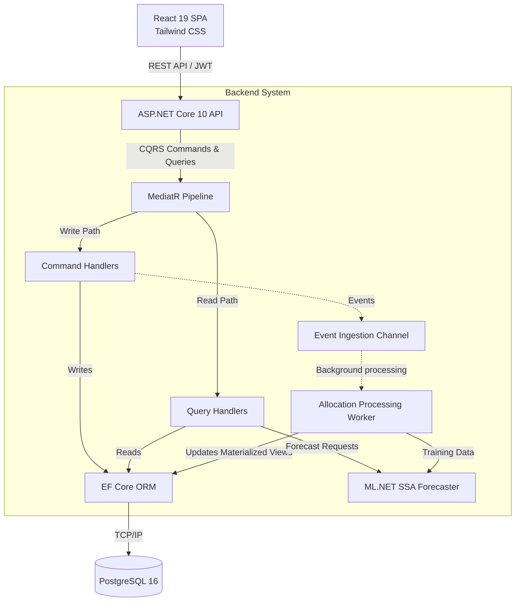
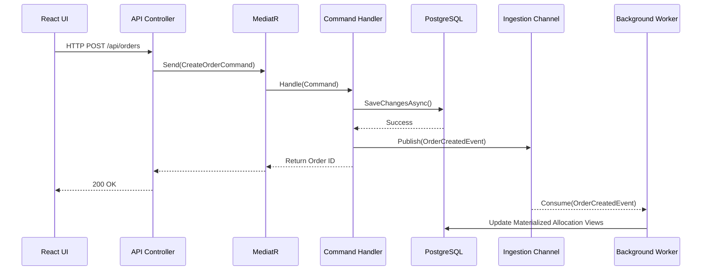

# MySupplyChain Portfolio Showcase

[](https://github.com/austinchima/MySupplyChain/actions/workflows/ci.yml)
[](https://dotnet.microsoft.com/)
[](LICENSE)

A production-grade supply chain management system engineered as a **portfolio showcase**. This project demonstrates enterprise software engineering principles using **ASP.NET Core 10**, **Clean Architecture**, **CQRS + MediatR**, **React 19**, **PostgreSQL**, **Adminer**, and **ML.NET SSA time series forecasting**.

*Note: This is an engineering case study and portfolio piece, not a commercial SaaS product.*

## Architecture

### High-Level System Design



### Component-Level Write Flow



### Project Structure

```text
MySupplyChain/
├── MySupplyChain.UI              # React 19 SPA, Tailwind CSS, Glassmorphism UI
├── MySupplyChain.Domain          # Entities, enums, value objects (zero dependencies)
├── MySupplyChain.Application     # CQRS handlers, interfaces, DTOs (depends on Domain)
├── MySupplyChain.Infrastructure  # EF Core, ML.NET, JWT auth (implements Application interfaces)
├── MySupplyChain.API             # Controllers, middleware, Swagger (composition root)
├── MySupplyChain.ModelTrainer    # Offline SSA model training console app
├── MySupplyChain.Tests           # Unit + integration tests (Passing suite)
└── graphify-out/                 # Standard AST knowledge graph metadata and visualization
```


### Key Design Decisions

| Decision | Rationale |
|---|---|
| **Clean Architecture** | Enforces dependency inversion — Domain has zero dependencies, Infrastructure implements Application interfaces |
| **CQRS + MediatR** | Separates read/write paths, enables pipeline behaviors (validation, logging) |
| **SSA Forecasting** | Singular Spectrum Analysis captures seasonality + trend without manual feature engineering |
| **Modern UI/UX** | React frontend with custom Tailwind CSS, SVG visualizations, and real-time status filtering |
| **JWT Auth** | Production-grade JWT + ASP.NET Identity with strict password policies and secure data isolation |
| **PostgreSQL Database** | Modern, open-source performance with native JSON support and UTC-strict timestamp enforcement |

## 🚀 Recent Production Updates

The system has been hardened with enterprise-grade features focusing on data integrity and security:

*   **High-Fidelity Ingestion Engine:** Developed a robust CSV parser with advanced field mapping (Product details, Customer entities, Order grouping). Implemented automated data cleaning and feature engineering to handle skewed production data.
*   **Security Hardening:** Enforced strong ASP.NET Identity password policies and implemented secure data management workflows, including multi-step word confirmation gates for irreversible data purges.
*   **PostgreSQL Compatibility:** Resolved low-level `DateTimeKind` conflicts by enforcing explicit UTC-normalization across the entire ingestion pipeline to satisfy PostgreSQL `timestamp with time zone` requirements.
*   **Responsive React UI:** Refactored the dashboard for 100% responsiveness, featuring custom SVG demand charts, real-time logistics tracking, and modular modal architectures.

## ML.NET Demand Forecasting

The forecasting engine uses **Singular Spectrum Analysis (SSA)** via `Microsoft.ML.TimeSeries` to decompose historical sales into trend, seasonality, and noise components.

**Features:**
- **Unit-Based Predictions:** Trains on physical quantity sold per day to predict exact unit demand.
- **Confidence Intervals:** Provides 95% upper/lower bounds to assist in risk-averse reordering.
- **Model Metrics:** Exposes RMSE and MAE directly in the UI for model transparency.
- **Per-Product SSA:** Trains individual models per SKU to capture unique demand patterns.

## Data Ingestion & Feature Engineering

The system features a sophisticated ingestion engine designed for real-world data variability:
- **Advanced Mapping:** Map custom CSV columns to Products, Prices, Customers, and Order IDs.
- **Normalization:** Automated whitespace trimming and string normalization for SKU matching.
- **Outlier Clamping:** Automated handling of negative quantities and prices to prevent forecasting bias.
- **Relational Integrity:** Intelligent batch-creation of products and customers during sales history imports.

## Quick Start

### Prerequisites
- [.NET 10 SDK](https://dotnet.microsoft.com/download/dotnet/10.0)
- [Node.js](https://nodejs.org/en/)
- [Entity Framework Core Tools](https://learn.microsoft.com/en-us/ef/core/cli/dotnet) (`dotnet tool install --global dotnet-ef`)
- [Docker Desktop](https://www.docker.com/products/docker-desktop/)

### Option 1: Docker Compose (recommended)

```bash
docker compose up --build
```

The stack automatically boots:
- **ASP.NET Core API** at `http://localhost:5000/swagger`
- **React Frontend UI** concurrently
- **PostgreSQL Database**
- **Adminer Database Client** at `http://localhost:8080`

## Tech Stack

| Layer | Technology |
|-------|-----------|
| Frontend | React 19, Vite, Tailwind CSS, SVG Visualizations |
| Runtime | .NET 10 / ASP.NET Core 10 |
| ORM | Entity Framework Core 10 |
| Database | PostgreSQL 16 / Adminer |
| Auth | JWT Bearer + ASP.NET Core Identity |
| ML | ML.NET 5.0 (SSA Time Series) |
| CQRS | MediatR 14 |
| Testing | xUnit + FluentAssertions + WebApplicationFactory |
| Containerization | Docker + Docker Compose |

## License

[MIT](LICENSE)
