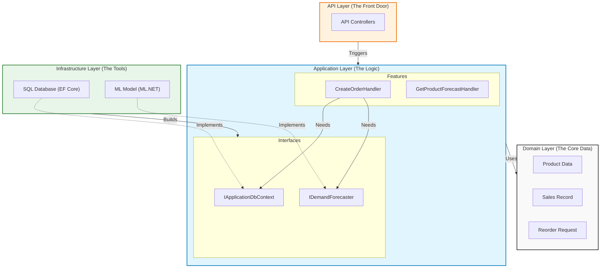
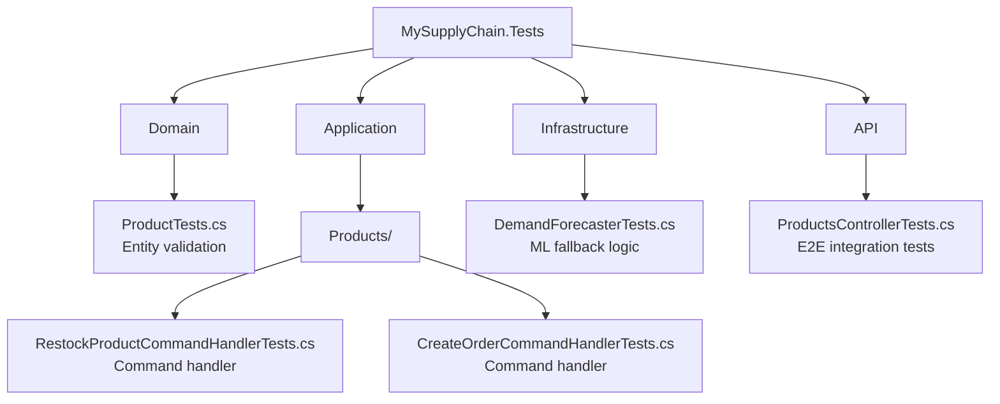

# MySupplyChain 🚛🤖

[](https://dotnet.microsoft.com/)
[](https://dotnet.microsoft.com/apps/machinelearning-ai/ml-dotnet)
[](LICENSE)
[]()
[]()
[]()

> An AI-powered, educational supply chain management system built with .NET 9, Clean Architecture, and ML.NET.

MySupplyChain is a smart inventory management system designed to demonstrate modern software architecture patterns. It tracks products, processes customer orders, and uses embedded **Artificial Intelligence** to predict future product demand, helping managers avoid stockouts and overstocking.

## 📋 Table of Contents

- [About The Project](#about-the-project)
- [Key Features](#key-features)
- [Architecture](#architecture)
- [Technologies](#technologies)
- [Getting Started](#getting-started)
- [Usage](#usage)
- [Testing](#testing)
- [Data Flow](#data-flow)

## 💡 About The Project

This project solves the critical business problem of **balancing supply and demand**.

- **Stockouts:** Losing sales because you ran out of a popular item.
- **Overstocking:** Wasting cash on inventory that just sits on the shelf.

MySupplyChain uses historical sales data to forecast future demand, enabling proactive inventory management. When stock levels dip below a defined reorder point, the system **automatically** generates a reorder request, complete with an AI-generated justification for the quantity needed.

## ✨ Key Features

- **📦 Product Management:** Track inventory levels, prices, and SKUs.
- **🛒 Order Processing:** Handle customer orders and automatically update stock.
- **🧠 AI Demand Forecasting:** Uses ML.NET to predict future sales based on historical data.
- **🔄 Automated Reordering:** Automatically generates reorder requests when stock is low, backed by AI predictions.
- **🏗️ Clean Architecture:** strictly separates Domain, Application, Infrastructure, and API layers.
- **⚡ CQRS:** Separates Read (Queries) and Write (Commands) operations for better scalability and maintenance.

## 🏗️ Architecture

The project follows **Clean Architecture** principles, ensuring that dependencies only point inwards.



## 🛠️ Technologies

| Category             | Technology                                                                                                                                            |
| -------------------- | ----------------------------------------------------------------------------------------------------------------------------------------------------- |
| **Framework**        | [](https://dotnet.microsoft.com/)                                  |
| **Web API**          | [](https://asp.net/)                                 |
| **ORM**              | [](https://docs.microsoft.com/ef/core/)                        |
| **Machine Learning** | [](https://dotnet.microsoft.com/apps/machinelearning-ai/ml-dotnet) |
| **Messaging**        | [](https://github.com/jbogard/MediatR)                                                       |
| **API Docs**         | [](https://swagger.io/)                                   |

## 🚀 Getting Started

Follow these steps to get the project running on your local machine.

### Prerequisites

- [.NET 9 SDK](https://dotnet.microsoft.com/download/dotnet/9.0)
- [SQL Server Express](https://www.microsoft.com/en-us/sql-server/sql-server-downloads) or LocalDB (comes with Visual Studio).

### Installation

1.  **Clone the repository**

    ```bash
    git clone https://github.com/yourusername/MySupplyChain.git
    cd MySupplyChain
    ```

2.  **Train the AI Model**
    Before running the API, you need to generate the ML model using the seeded data.

    ```bash
    cd MySupplyChain.ModelTrainer
    dotnet run
    ```

    _This will create the `sales_model.zip` file in the Infrastructure layer._

3.  **Run the API**
    Navigate to the API project and run it. This will also automatically create the database and seed it with initial data.

    ```bash
    cd ../MySupplyChain.API
    dotnet run
    ```

4.  **Access the App**
    Open your browser and navigate to the URL shown in the console (usually `https://localhost:7066/swagger` or similar) to see the Swagger UI.

## 🎮 Usage

You can interact with the system entirely through the Swagger UI:

1.  **Check Products:** Use `GET /api/products` to see the initial stock.
2.  **Place an Order:** Use `POST /api/orders` to buy a product.
    - _Try buying enough to drop stock below the Reorder Point (e.g., buy 40 Dell Laptops)._
3.  **Check Reorder Requests:** Use `GET /api/reorder-requests` to see if the system automatically generated a request based on your order.
4.  **Get a Forecast:** Use `GET /api/products/{id}/forecast` to see what the AI predicts for a specific item.

## 🧪 Testing

The project includes comprehensive test coverage across all layers:

### Test Statistics

- **Total Tests:** 12 passing
- **Domain Tests:** 1
- **Application Tests:** 6
- **Infrastructure Tests:** 2
- **Integration Tests:** 3

### Running Tests

```bash
# Run all tests
dotnet test

# Run tests with detailed output
dotnet test --logger "console;verbosity=detailed"

# Run tests in specific project
cd MySupplyChain.Tests
dotnet test
```

### Test Structure



### What's Tested

- ✅ **Stock Management:** Restocking products with valid/invalid quantities
- ✅ **Order Processing:** Stock reduction and insufficient stock scenarios
- ✅ **Automatic Reordering:** Reorder request generation when stock is low
- ✅ **AI Forecasting:** ML model fallback behavior
- ✅ **End-to-End Workflows:** Full API integration tests

For detailed testing information, see [MySupplyChain.Tests/README.md](MySupplyChain.Tests/README.md).

## 🔄 Data Flow Example

**Scenario: A customer places an order.**

1.  **API:** `OrdersController` receives `POST /api/orders`.
2.  **Application:** `CreateOrderCommandHandler` executes.
    - Deducts stock from the **Domain** `Product` entity.
    - Saves changes via **Infrastructure** `ApplicationDbContext`.
3.  **Logic:** Handler checks if `CurrentStock < ReorderPoint`.
4.  **AI Trigger:** If low stock, handler calls `IDemandForecaster`.
5.  **Infrastructure:** `DemandForecaster` uses the **ML.NET** model to predict need.
6.  **Result:** A new `ReorderRequest` is saved to the database with a justification like _"Predicted demand of 25 units over the next 30 days."_

## 📁 Project Structure

Each project has its own detailed README with architecture specifics:

- 📦 [MySupplyChain.Domain](MySupplyChain.Domain/README.md) - Core business entities
- ⚙️ [MySupplyChain.Application](MySupplyChain.Application/README.md) - Business logic and CQRS handlers
- 🔧 [MySupplyChain.Infrastructure](MySupplyChain.Infrastructure/README.md) - Database and ML.NET implementation
- 🌐 [MySupplyChain.API](MySupplyChain.API/README.md) - RESTful API endpoints
- 🤖 [MySupplyChain.ModelTrainer](MySupplyChain.ModelTrainer/README.md) - ML model training
- 🧪 [MySupplyChain.Tests](MySupplyChain.Tests/README.md) - Comprehensive test suite

---

_This project is for educational purposes._
