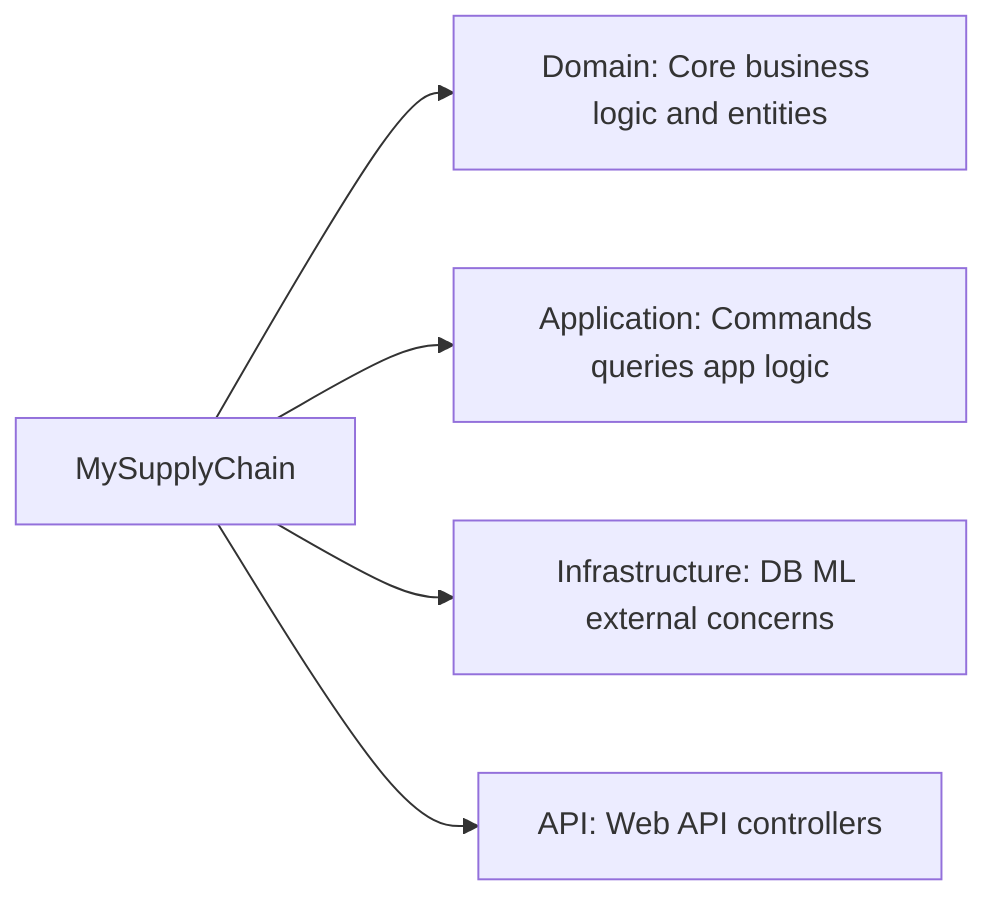
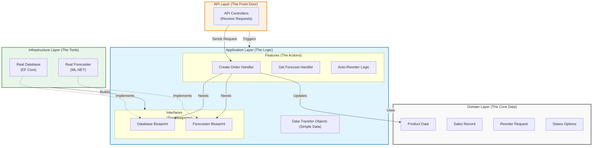
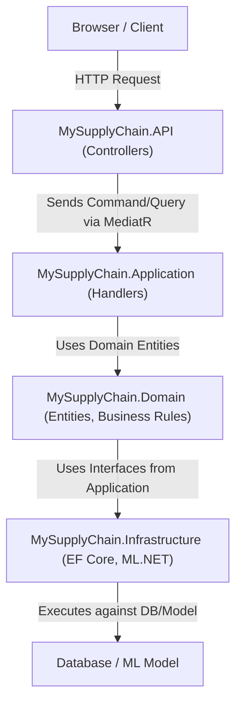

# MySupplyChain: An Educational Guide

  

Welcome to the educational guide for the MySupplyChain project! This document will walk you through the entire system, from its high-level architecture to the nitty-gritty details of each file. By the end, you'll have a deep understanding of how this AI-powered supply chain management system works.

  

## 1. PROJECT OVERVIEW

  

### What this system does in simple terms

  

MySupplyChain is a smart inventory management system. It tracks products, processes customer orders, and uses Artificial Intelligence (AI) to predict future product demand. When stock levels get low, it automatically creates a "reorder request" with a justification, helping a supply chain manager make informed decisions about what to restock and when.

  

### The main business problem it solves

  

This system solves a critical business problem: **balancing supply and demand to avoid stockouts and overstocking.**

  

- **Stockouts:** If you run out of a popular product, you lose sales and disappoint customers.

  

- **Overstocking:** If you order too much of a product that doesn't sell, you tie up cash in inventory that just sits on a shelf.

  

MySupplyChain uses historical sales data to forecast future demand, allowing for smarter, proactive inventory management instead of reactive, gut-feel decisions.

  

### The key technologies used

  

- **.NET 9:** The modern, cross-platform framework for building the application.

  

- **ASP.NET Core:** Used to build the web API that exposes the system's functionality.

  

- **Entity Framework Core (EF Core):** The Object-Relational Mapper (O/RM) used to communicate with the database. It allows us to work with C# objects (like `Product` and `SalesHistory`) and translates that code into database queries.

  

- **SQL Server:** The relational database used to store all the application data (products, sales, etc.).

  

- **ML.NET:** Microsoft's open-source machine learning framework. It's used to train a demand forecasting model and make predictions at runtime.

  

- **MediatR:** A library that helps implement the CQRS pattern by decoupling the API controllers from the business logic.

  

- **Clean Architecture:** A software design philosophy that separates the code into layers (Domain, Application, Infrastructure, API) to create a more maintainable and testable system.

  

- **CQRS (Command Query Responsibility Segregation):** A pattern that separates read operations (Queries) from write operations (Commands).

  

## 2. ARCHITECTURE EXPLANATION

  

### Folder Structure

  

The project is organized into four main layers, following the principles of Clean Architecture.

  

  

### Clean Architecture

  

Clean Architecture is all about the **separation of concerns**. It organizes the code into layers, with a strict rule: **dependencies can only point inwards**.

  

  

- **Inner Layers (Domain, Application):** These layers contain the core business rules and application logic. They don't know or care about the outside world (like what database is being used or how the UI is presented).

  

- **Outer Layers (Infrastructure, API):** These layers handle external concerns. The `Infrastructure` layer implements the interfaces defined in the `Application` layer (e.g., for database access or ML forecasting). The `API` layer is the entry point that receives HTTP requests and triggers the application logic.

  

**Why use it?**

  

- **Independence:** The core business logic isn't tied to a specific database, UI, or framework. You could swap SQL Server for PostgreSQL, or a Web API for a desktop app, without changing the `Domain` or `Application` layers.

  

- **Testability:** Because the business logic is isolated, it's incredibly easy to test. You can test your `Application` logic with a "fake" in-memory database, making your tests fast and reliable.

  

- **Maintainability:** When you need to change how the database works, you only have to touch the `Infrastructure` layer. The core business rules remain safe and untouched.

  

### CQRS (Command Query Responsibility Segregation)

  

CQRS is a simple but powerful pattern. It states that you should separate methods that **change state (Commands)** from methods that **read state (Queries)**.

  

- **Commands:** These are operations that write data or change the system's state. Examples: `CreateOrderCommand`, `RestockProductCommand`. They typically don't return much data, maybe just an ID or a success/failure status.

  

- **Queries:** These are operations that read and return data. Example: `GetAllProductsQuery`, `GetProductForecastQuery`. They never, ever change the state of the system.

  

**Why use it?**

  

- **Simplicity:** Each handler has a single, focused responsibility. A command handler only worries about writing data correctly, and a query handler only worries about reading it efficiently.

  

- **Optimization:** You can optimize read and write operations independently. For example, you might use complex database indexing for your queries that wouldn't be necessary for your commands.

  

- **Scalability:** In very large systems, you can even scale the read and write databases separately.

  

### How the Layers Interact

  

Here’s a visual representation of how a request flows through the system:

  

  

## 3. FILE-BY-FILE BREAKDOWN

  

### Domain Layer

  

This is the heart of the application. It contains the business entities and has no dependencies on any other layer.

  

- **`Entities/Product.cs`**:

  

- **What it does:** Represents a product in our inventory. It has properties like `Name`, `CurrentStock`, and `ReorderPoint`.

  

- **Why it exists:** To model the core concept of a product.

  

- **Key concepts:** This is a Plain Old CLR Object (POCO). It's a simple class with properties, representing a "thing" in our business domain.

  

- **Connections:** Used by the `Application` layer to perform business logic and by the `Infrastructure` layer to create the `Products` table in the database.

  

- **`Entities/SalesHistory.cs`**:

  

- **What it does:** Represents a record of a sale for a specific product on a specific date.

  

- **Why it exists:** To track historical sales data, which is crucial for our ML model.

  

- **Key concepts:** Another POCO entity. It has a relationship with the `Product` entity.

  

- **Connections:** Linked to a `Product`. Used by the `CreateOrderCommandHandler` to record new sales and by the `GetProductForecastQueryHandler` to feed data to the ML model.

  

- **`Entities/ReorderRequest.cs`**:

  

- **What it does:** Represents a system-generated request to reorder a product.

  

- **Why it exists:** To formalize the process of reordering and provide a clear audit trail. It includes the `Justification` from the AI.

  

- **Key concepts:** This entity captures a business process. The `Status` enum (`Pending`, `Approved`, `Rejected`) tracks its lifecycle.

  

- **Connections:** Created by the `CreateOrderCommandHandler` when stock is low. Read by the `GetReorderRequestsQueryHandler` to display to the user.

  

- **`Enums/Status.cs`**:

  

- **What it does:** Defines the possible statuses for a `ReorderRequest`.

  

- **Why it exists:** To provide a strongly-typed way to represent the state of a reorder request, avoiding "magic strings" like `"Pending"`.

  

- **Key concepts:** Enums are a clean way to represent a fixed set of states.

  

### Application Layer

  

This layer orchestrates the business logic. It uses the `Domain` entities to perform tasks. It defines interfaces for external dependencies (like the database) but doesn't implement them.

  

- **`Common/Interfaces/IApplicationDbContext.cs`**:

  

- **What it does:** Defines the contract for our database context. It specifies what `DbSet`s (tables) should be available.

  

- **Why it exists:** This is a key part of Clean Architecture. The `Application` layer depends on this _interface_, not on a concrete implementation. This allows us to swap out the database technology in the `Infrastructure` layer without changing any application code.

  

- **Key concepts:** Dependency Inversion Principle. The `Application` layer owns the interface.

  

- **Connections:** Implemented by `ApplicationDbContext` in the `Infrastructure` layer. Injected into command and query handlers.

  

- **`Common/Interfaces/IDemandForecaster.cs`**:

  

- **What it does:** Defines the contract for the AI-powered demand forecasting service.

  

- **Why it exists:** To decouple the application logic from the specific implementation of the ML model. We could swap ML.NET for another framework (like TensorFlow) by simply creating a new implementation of this interface.

  

- **Key concepts:** Abstraction. The application only cares about _what_ the forecaster does, not _how_ it does it.

  

- **Connections:** Implemented by `DemandForecaster` in the `Infrastructure` layer. Injected into handlers that need to predict demand.

  

- **`Products/Commands/CreateProduct/CreateProductCommand.cs` & `CreateProductCommandHandler.cs`**:

  

- **What they do:** The `CreateProductCommand` is a simple data carrier that holds the information needed to create a product. The `CreateProductCommandHandler` contains the logic to receive this command, create a new `Product` entity, and save it to the database via the `IApplicationDbContext`.

  

- **Why they exist:** To handle the use case of creating a new product, following the CQRS pattern.

  

- **Key concepts:** CQRS, MediatR, Dependency Injection. The handler depends on the `IApplicationDbContext` interface.

  

- **Connections:** The command is sent from the `ProductsController`. The handler uses the `Product` entity and the `IApplicationDbContext`.

  

- **`Products/Queries/GetAllProducts/GetAllProductsQuery.cs` & `GetAllProductsHandler.cs`**:

  

- **What they do:** The `GetAllProductsQuery` is a request to get all products. The `GetAllProductsHandler` queries the database via `IApplicationDbContext`, maps the `Product` entities to `ProductDto` objects (Data Transfer Objects), and returns them.

  

- **Why they exist:** To handle the use case of listing all products.

  

- **Key concepts:** CQRS, DTOs. DTOs are used to shape the data specifically for the API response, preventing over-exposing of domain entities.

  

- **Connections:** The query is sent from the `ProductsController`. The handler reads from the database.

  

- **`Products/Queries/GetProductForecast/GetProductForecastQuery.cs` & `GetProductForecastQueryHandler.cs`**:

  

- **What they do:** This is a core feature. The handler retrieves historical sales data, calls the `IDemandForecaster` to get a prediction, and then constructs a `ProductForecastDto` with a user-friendly recommendation.

  

- **Why they exist:** To provide the AI-powered forecasting feature.

  

- **Key concepts:** CQRS, Abstraction (using `IDemandForecaster`), DTOs.

  

- **Connections:** The query is sent from the `ProductsController`. The handler uses `IApplicationDbContext` to get sales data and `IDemandForecaster` to get the prediction.

  

### Infrastructure Layer

  

This layer contains the implementations of the interfaces defined in the `Application` layer. It's where all the "dirty" details of external systems live.

  

- **`Persistence/ApplicationDbContext.cs`**:

  

- **What it does:** This is the Entity Framework Core implementation of `IApplicationDbContext`. It configures the database tables, relationships, and seed data.

  

- **Why it exists:** To handle all communication with the SQL Server database.

  

- **Key concepts:** EF Core, DbContext, DbSet, OnModelCreating, Seed Data.

  

- **Connections:** Implements `IApplicationDbContext`. It's registered in `DependencyInjection.cs` and injected into handlers in the `Application` layer.

  

- **`MachineLearning/DemandForecaster.cs`**:

  

- **What it does:** This is the ML.NET implementation of `IDemandForecaster`. It loads the pre-trained `sales_model.zip` file and uses it to make predictions.

  

- **Why it exists:** To encapsulate all the ML.NET-specific code.

  

- **Key concepts:** ML.NET, `MLContext`, `PredictionEngine`.

  

- **Connections:** Implements `IDemandForecaster`. It's registered in `DependencyInjection.cs` and injected into handlers.

  

- **`DependencyInjection.cs`**:

  

- **What it does:** A crucial setup file. It registers the `ApplicationDbContext` and `DemandForecaster` with the dependency injection container, linking the interfaces from the `Application` layer to their concrete implementations in this layer.

  

- **Why it exists:** To configure the services for the application at startup.

  

- **Key concepts:** Dependency Injection, `IServiceCollection`.

  

### API Layer

  

This is the entry point to the application. It's a thin layer that receives HTTP requests and immediately delegates the work to the `Application` layer using MediatR.

  

- **`Controllers/ProductsController.cs`**:

  

- **What it does:** Defines the API endpoints related to products (e.g., `POST /api/products`, `GET /api/products/{id}/forecast`).

  

- **Why it exists:** To expose the product-related functionality of the application over HTTP.

  

- **Key concepts:** ASP.NET Core Controllers, Routing, Dependency Injection (of `IMediator`).

  

- **Connections:** It doesn't contain any business logic. It simply creates a command or query object and sends it using `_mediator.Send()`.

  

- **`Program.cs`**:

  

- **What it does:** The main entry point of the web application. It configures the web server, registers all the services from the other layers (`AddApplication()`, `AddInfrastructure()`), and sets up the HTTP request pipeline (e.g., Swagger, HTTPS redirection).

  

- **Why it exists:** To bootstrap and run the entire ASP.NET Core application.

  

- **Key concepts:** ASP.NET Core startup, Dependency Injection container (`builder.Services`).

  

## 4. DATA FLOW WALKTHROUGH

  

### A customer places an order (`CreateOrderCommand`)

  

1.  **HTTP Request:** A client sends a `POST` request to `/api/orders` with a JSON body like `{"productId": 1, "quantity": 5}`.

  

2.  **Controller:** The `OrdersController` receives the request. The ASP.NET Core framework automatically binds the JSON body to a `CreateOrderCommand` object.

  

3.  **MediatR:** The controller calls `_mediator.Send(command)`. MediatR finds the handler for `CreateOrderCommand`, which is `CreateOrderCommandHandler`.

  

4.  **Handler:** `CreateOrderCommandHandler` is executed.

  

- It uses the injected `IApplicationDbContext` to find the `Product` by its ID.

  

- It checks if there is enough stock.

  

- If so, it decrements the `product.CurrentStock`.

  

- It creates a new `SalesHistory` entity to record the sale.

  

- It calls `_context.SaveChangesAsync()` to persist these changes to the database.

  

5.  **Reorder Check:**

  

- The handler checks if `product.CurrentStock` is now below the `product.ReorderPoint`.

  

- If it is, it calls the private `CreateReorderRequestAsync` method.

  

6.  **AI-Powered Reorder:**

  

- `CreateReorderRequestAsync` queries the database for the last 30 sales records for this product.

  

- It calls `_forecaster.PredictDemandAsync()` with this historical data.

  

- The `DemandForecaster` (in the `Infrastructure` layer) uses the loaded ML.NET model to predict future demand.

  

- The handler uses this prediction to calculate a `quantityToOrder` and creates a `ReorderRequest` entity with an AI-generated `Justification` string.

  

- It saves the new `ReorderRequest` to the database.

  

7.  **HTTP Response:** The handler returns the new stock level. The controller wraps this in a `200 OK` response to the client.

  

### The system checks forecast (`GetProductForecastQuery`)

  

1.  **HTTP Request:** A client sends a `GET` request to `/api/products/1/forecast`.

  

2.  **Controller:** The `ProductsController` receives the request. It creates a `GetProductForecastQuery` object with `ProductId = 1`.

  

3.  **MediatR:** The controller calls `_mediator.Send(query)`. MediatR finds the `GetProductForecastQueryHandler`.

  

4.  **Handler:** `GetProductForecastQueryHandler` is executed.

  

- It uses `IApplicationDbContext` to get the product and its sales history.

  

- It calls `_forecaster.PredictDemandAsync()` to get the AI prediction.

  

- It performs business logic to determine if a reorder is recommended based on the prediction and a safety buffer.

  

- It creates a `ProductForecastDto` containing the prediction and a user-friendly `Recommendation` string.

  

5.  **HTTP Response:** The handler returns the DTO. The controller sends it back to the client as a `200 OK` response with the JSON data.

  

## 5. KEY CONCEPTS EXPLAINED

  

- **Clean Architecture:** A design that isolates your core business logic from external details like databases, frameworks, and UIs. It achieves this by making sure dependencies only point inwards, from outer layers (like API and Infrastructure) to inner layers (Application and Domain). This makes the system flexible, testable, and easier to maintain.

  

- **CQRS:** The practice of separating read operations (Queries) from write operations (Commands). This simplifies your code, as each class has a single responsibility. `CreateOrderCommand` only changes data, while `GetAllProductsQuery` only reads it. They are handled by different classes, making them easier to develop, optimize, and test.

  

- **MediatR:** A library that acts as a "middle-man" between your API controllers and your business logic. When a controller receives a request, it doesn't call the business logic directly. Instead, it "sends" a command or query object to MediatR. MediatR then finds the correct handler for that object and executes it. This decouples your controllers from your application logic, meaning the controller doesn't need to know which class handles the request.

  

- **Dependency Injection (DI):** A pattern where a class receives its dependencies from an outside source, rather than creating them itself. In this project, `Program.cs` sets up a "DI container". It registers services, like `services.AddScoped<IApplicationDbContext, ApplicationDbContext>()`. When a class like `CreateOrderCommandHandler` needs an `IApplicationDbContext`, the container automatically provides (injects) the `ApplicationDbContext` instance. This makes the code loosely coupled and easy to test with mock dependencies.

  

- **Repository Pattern:** This pattern abstracts the data access logic. In our project, `IApplicationDbContext` acts as our repository interface. The command handlers use this interface to talk to the "database" without knowing it's actually Entity Framework Core. This is a key part of Clean Architecture.

  

- **ML.NET Integration:** The integration is done through the `IDemandForecaster` interface. The `Application` layer only knows about this interface. The `Infrastructure` layer provides the concrete `DemandForecaster` class, which uses ML.NET's `MLContext` and `PredictionEngine` to load our `sales_model.zip` and make predictions. This keeps all the ML-specific code isolated in the `Infrastructure` layer.

  

- **Entity Framework Core:** EF Core is the bridge between our C# `Domain` entities (`Product`, `SalesHistory`) and the database. The `ApplicationDbContext` defines `DbSet` properties for each entity, which correspond to tables in the database. When we write LINQ queries like `_context.Products.ToListAsync()`, EF Core translates this C# code into SQL and executes it against the database. When we call `_context.SaveChangesAsync()`, it takes any changes we've made to our C# objects and generates the necessary `INSERT`, `UPDATE`, or `DELETE` SQL commands.

  

## 6. THE ML MODEL EXPLAINED

  

### What the model does

  

The model is a **regression model** trained to perform **demand forecasting**. Its goal is to predict the `QuantitySold` for a given product based on various features.

  

### How it's trained

  

The model is trained by the `MySupplyChain.ModelTrainer` console application.

  

- **Data:** It uses the `sales_data.csv` file, which contains historical sales records. Each row has features like `ProductId`, `Date`, `QuantitySold`, `Price`, `DayOfWeek`, and `Month`.

  

- **Algorithm:** It uses the `Sdca` (Stochastic Dual Coordinate Ascent) regression trainer, a good general-purpose algorithm for regression tasks.

  

- **Pipeline:** The training pipeline first concatenates several input columns (`ProductId`, `QuantitySold`, `DayOfWeek`, `Month`) into a single `Features` vector. This vector is then fed into the `Sdca` trainer to teach the model the relationship between the features and the `QuantitySold` (which is the label, or the thing we want to predict).

  

### How it's loaded and used at runtime

  

1.  **Loading:** The trained model is saved as `sales_model.zip` in the `MySupplyChain.Infrastructure/MLModels` folder. When the application starts, the `DemandForecaster` class (which is a singleton) loads this file into memory using `_mlContext.Model.Load()`.

  

2.  **Usage:** When a handler calls `_forecaster.PredictDemandAsync()`, the `DemandForecaster` creates a `PredictionEngine`. It populates a `ModelInput` object with data from the request and calls `predictionEngine.Predict()`. This runs the input data through the loaded model and returns a `ModelOutput` object containing the `PredictedDemand`.

  

### How predictions drive business logic

  

The raw prediction from the model is just a number. The real value comes from how it's used in the business logic.

  

1.  **Reorder Trigger:** In `CreateOrderCommandHandler`, after a sale, the system checks if the stock has fallen below the reorder point. If it has, it triggers a forecast.

  

2.  **Intelligent Reorder Quantity:** The forecast (`predictedDemand`) is used to calculate how much to reorder. The logic `(int)Math.Max(50, prediction * 1.5)` ensures we order enough to cover the predicted demand plus a 50% buffer, with a minimum order of 50 units.

  

3.  **Justification:** The prediction is included in the `ReorderRequest.Justification` string, giving the supply chain manager clear, data-driven evidence for why the reorder was suggested.

  

4.  **Proactive Recommendations:** In `GetProductForecastQueryHandler`, the prediction is used to proactively tell the user if they _should_ reorder, even if the reorder point hasn't been hit yet, based on a combination of the forecast and a safety buffer.

  

## 7. COMMON PATTERNS USED

  

- **DTOs (Data Transfer Objects):** DTOs like `ProductDto` and `ReorderRequestDto` are used to shape data for the API. The `GetAllProductsHandler` doesn't return the `Product` domain entity directly. Instead, it maps it to a `ProductDto`. This is important because it allows us to add UI-specific properties (like `HealthStatus`) without polluting our domain model. It also prevents accidentally exposing sensitive data that might be on the domain entity.

  

- **How validation could be added:** Validation is a cross-cutting concern. A great way to add it in this architecture is by using a MediatR pipeline behavior. You could create a `ValidationBehavior` that intercepts every command before it reaches its handler. This behavior could use a library like `FluentValidation` to check the command for errors (e.g., `Quantity` must be greater than 0). If validation fails, it can throw an exception before the handler even runs, keeping the handler logic clean.

  

- **How errors are handled:** Currently, error handling is basic, using `try-catch` blocks in the controllers. A more robust approach would be to use a custom exception middleware in `Program.cs`. This middleware could catch exceptions, log them, and transform them into standardized, user-friendly JSON error responses, so you don't have to repeat `try-catch` logic in every controller action.

  

- **How the database context is injected:** The `ApplicationDbContext` is registered in `DependencyInjection.cs` with a "scoped" lifetime (`services.AddDbContext`). This means that for each HTTP request, a single instance of `ApplicationDbContext` is created and shared by all the handlers that are involved in that request. This is the standard and recommended way to manage the DbContext lifetime in a web application.

  

## 8. LEARNING CHECKPOINTS

  

After reading this guide, you should be able to:

  

- **Explain the difference between Domain and Infrastructure:** The `Domain` layer defines _what_ the business is (entities like `Product`). The `Infrastructure` layer defines _how_ those things are implemented with external tools (like storing a `Product` in a SQL Server database using EF Core).

  

- **Trace a request from API to database and back:** You can follow the flow from an HTTP request hitting a `Controller`, which sends a `Command` via `MediatR` to a `Handler`, which uses the `DbContext` to talk to the database.

  

- **Understand why ML.NET is in Infrastructure not Domain:** The `Domain` layer should have no external dependencies. ML.NET is an external technology, a detail of _how_ we do forecasting. By placing it in `Infrastructure` and depending on an interface (`IDemandForecaster`), we keep our core `Application` and `Domain` layers clean and independent.

  

- **Explain how MediatR decouples controllers from business logic:** Controllers don't know or care which class handles a `CreateOrderCommand`. They just send the command to MediatR. This means you can change the handler, or even add multiple handlers (e.g., for logging), without ever touching the controller code.

  

- **Understand the reorder trigger flow:** A sale is made (`CreateOrderCommand`). The stock is checked against the `ReorderPoint`. If it's low, a forecast is triggered using the `IDemandForecaster`. The forecast result is used to create a `ReorderRequest` with a calculated quantity and a justification, which is then saved to the database.