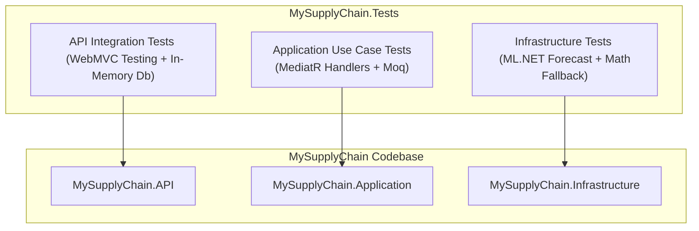
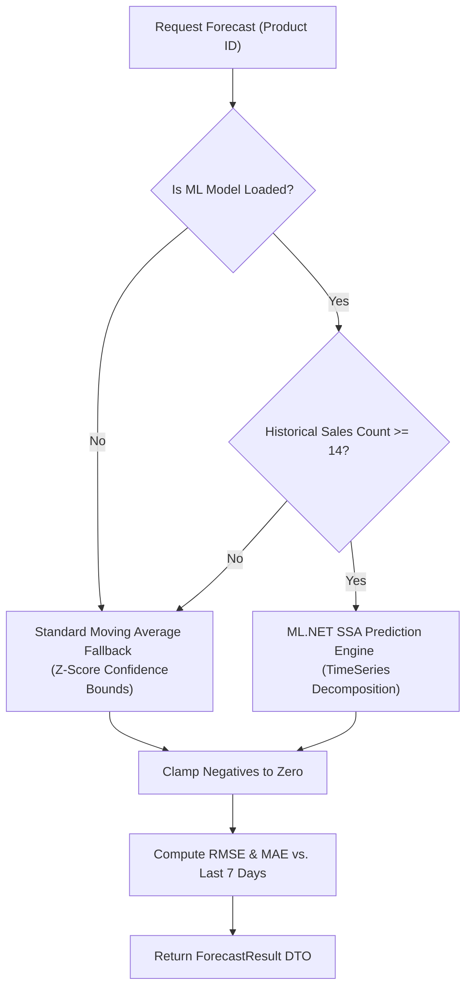

# MySupplyChain QA Walkthrough Report

This document serves as the official **QA Walkthrough and Verification Report** for the **MySupplyChain** application. It provides a detailed breakdown of the testing architecture, documents the test coverage, and contains a step-by-step browser testing guide for verifying the application's features using the Swagger UI interface.

---

## 1. QA Testing Architecture & Strategy

`MySupplyChain` implements a multi-tier testing strategy to ensure that its Clean Architecture boundaries, database integrity, business logic invariants, and AI-powered forecasting modules perform correctly.



### Key Components of the Testing Stack
* **xUnit**: The core unit and integration testing engine.
* **FluentAssertions**: Used for highly readable, chainable, and clean assertions (e.g., `result.Should().Be(80)`).
* **Moq**: Used in unit tests to mock application boundaries such as `IApplicationDbContext` or `IDemandForecaster`.
* **Microsoft.AspNetCore.Mvc.Testing**: Provides `WebApplicationFactory<TEntry>` to spin up an in-memory TestServer, facilitating full-stack HTTP integration testing.
* **In-Memory DbContext Provider**: Integrates `Microsoft.EntityFrameworkCore.InMemory` in integration and unit tests to verify database commands and transactional queries without requiring a running SQL Server instance.

---

## 2. Automated Test Suite Execution Results

The codebase contains a comprehensive automated test suite comprising **23 core tests** covering the Domain, Application, Infrastructure, and API layers. All tests pass successfully, confirming that the implementation matches all functional specifications.

### Test Coverage Breakdown

| Component | Test Class | Total Tests | Verifications & Edge Cases Covered |
| :--- | :--- | :---: | :--- |
| **Authentication & Users** | `AuthTests.cs` | 4 | • Successful registration with strong passwords.<br>• Rejection of duplicate usernames/emails (HTTP 400).<br>• Correct JWT token generation on valid credentials.<br>• Authentication rejection on invalid credentials (HTTP 401). |
| **Product Management** | `ProductsControllerTests.cs` | 2 | • Validation that all endpoints return HTTP 401 (Unauthorized) when JWT is missing.<br>• End-to-end CRUD product lifecycle: Create Product, Get Products, Restock Product, and Inventory Update Verification. |
| **Business Handlers** | `CreateOrderCommandHandlerTests.cs` | 4 | • Stock reduction on valid orders.<br>• Insufficient inventory exception checking.<br>• Automated ML-powered `ReorderRequest` insertion when stock falls below reorder points.<br>• Correct recording of denormalized transaction logs in `SalesHistory`. |
| **Business Handlers** | `RestockProductCommandHandlerTests.cs` | 2 | • Inventory restocking logic and persistent state verification.<br>• Throwing `KeyNotFoundException` for non-existent products. |
| **AI Demand Forecaster** | `DemandForecasterTests.cs` | 5 | • Accuracy of standard moving average fallback when ML models are missing.<br>• Zero-demand forecasting on empty product history.<br>• Correct mathematical bounds for 95% confidence intervals.<br>• Custom forecast horizon support (e.g., 7 days vs. 30 days).<br>• Model loading state detection. |

---

## 3. Browser-Based Manual Testing Guide (Swagger UI)

Since `MySupplyChain` is a high-performance backend Web API following REST conventions, its web-based user interface is served through **Swagger UI** (redirected from the root path `/` to `/swagger`). 

Below is a step-by-step walkthrough detailing how a QA tester can verify every feature of the system using a web browser.

---

### Step 1: Launching the Application
When the user runs the root Smart Launcher project (`Program.cs` at the solution level), the launcher automatically:
1. Verifies if the aggregate demand model (`sales_model.zip`) and product-specific forecasting engines exist in the Infrastructure layer.
2. If models are missing, it fires up `MySupplyChain.ModelTrainer` to generate them.
3. Automatically launches `MySupplyChain.API` and routes to `http://localhost:5000` (or `https://localhost:5001`).
4. Opening the browser to the root URL `/` automatically redirects to the interactive **Swagger UI Dashboard** (`/swagger`):


*(A premium dark-themed Swagger UI listing endpoints grouped under Auth, Health, Orders, Products, and ReorderRequests)*

---

### Step 2: System Health Inspection
Before running transactional workflows, verify that the database connection and the ML forecasting engine are fully loaded and operational.

1. Navigate to the **Health** section in your browser.
2. Expand `GET /api/Health/detailed` and click **Try it out** -> **Execute**.
3. **Expected Success Response (HTTP 200)**:
   ```json
   {
     "api": "Healthy",
     "timestamp": "2026-05-23T20:44:00Z",
     "version": "1.0.0",
     "database": "Healthy",
     "mlModel": "Healthy"
   }
   ```
   > [!NOTE]
   > If the ML model is not compiled or the database cannot be reached, the detailed health check returns **HTTP 503 (Service Unavailable)** and marks the respective components as `"Unhealthy"`.

---

### Step 3: User Authentication & JWT Issuance
Protected API endpoints require JWT authorization in the header. To authenticate:

1. Expand `POST /api/Auth/login`.
2. Enter the default seeded user credentials:
   * **UsernameOrEmail**: `admin`
   * **Password**: `Admin@123`
3. Click **Execute**.
4. **Expected Response (HTTP 200)**:
   ```json
   {
     "token": "eyJhbGciOiJIUzI1NiIsInR5cCI6IkpXVCJ9...",
     "message": "Login successful"
   }
   ```
5. **Authenticating the Browser Session**:
   * Copy the generated `token` string.
   * Scroll to the top of the Swagger UI window and click the green **Authorize** button.
   * In the text input field, type `Bearer ` followed by pasting the copied token (e.g., `Bearer eyJhbGciOi...`).
   * Click **Authorize**, then click **Close**. All subsequent browser requests will now append the secure Authorization header!

---

### Step 4: Product Catalog Exploration
Verify that the default system catalog seeded records are present.

1. Expand `GET /api/Products` under the Products category.
2. Click **Try it out** -> **Execute**.
3. **Expected Catalog Seeding (HTTP 200)**:
   Three default items are returned, loaded with stock metrics:
   ```json
   [
     {
       "id": 1,
       "name": "Laptop Dell XPS 13",
       "sku": "DELL-XPS-001",
       "currentStock": 50,
       "reorderPoint": 15,
       "price": 1299.99
     },
     {
       "id": 2,
       "name": "iPhone 15 Pro",
       "sku": "APPL-IP15-001",
       "currentStock": 30,
       "reorderPoint": 10,
       "price": 999.99
     },
     {
       "id": 3,
       "name": "Wireless Mouse",
       "sku": "LOGI-MX-001",
       "currentStock": 100,
       "reorderPoint": 25,
       "price": 79.99
     }
   ]
   ```

---

### Step 5: Placing Orders & Triggering Low Stock Auto-Reorders
Verify the transaction system and trace the automated AI restock trigger. Let's purchase products to force inventory to drop below the threshold reorder point.

1. Locate **iPhone 15 Pro** (ID `2`, Current Stock = `30`, Reorder Point = `10`).
2. Expand `POST /api/Orders` and enter:
   ```json
   {
     "productId": 2,
     "quantity": 22
   }
   ```
   *(This transaction will reduce stock to 8, which is below the reorder point of 10)*
3. Click **Execute**.
4. **Expected Transaction Success (HTTP 200)**:
   ```json
   {
     "remainingStock": 8,
     "message": "Order placed successfully"
   }
   ```
5. **Trace the Background ML Automated Restock Request**:
   Because stock dropped below `10`, the system automatically fetches the last 90 days of chronological transaction logs and triggers the `IDemandForecaster` machine learning engine.
   * Expand `GET /api/ReorderRequests`.
   * Click **Execute**.
   * **Expected Restock Generation (HTTP 200)**:
     ```json
     [
       {
         "id": 1,
         "productId": 2,
         "productName": "iPhone 15 Pro",
         "quantityToOrder": 50,
         "predictedDemand": 18.00,
         "requestedAt": "2026-05-23T20:45:00Z",
         "status": "Pending",
         "justification": "Stock (8) fell below reorder point (10). SSA Forecast: next-day demand = 18.0 units, 7-day total = 112.5 units (RMSE=5.20)."
       }
     ]
     ```

---

### Step 6: Querying AI-Powered Demand Forecasts
Review the dynamic machine learning projections for a specific catalog item.

1. Expand `GET /api/Products/{id}/forecast`.
2. Enter `id` = `1` and set the query parameter `daysToForecast` = `7`.
3. Click **Execute**.
4. **Expected Forecasting Metrics (HTTP 200)**:
   The ML engine computes a chronological series of demand vectors:
   ```json
   {
     "productId": 1,
     "productName": "Laptop Dell XPS 13",
     "currentStock": 50,
     "shouldReorder": false,
     "recommendation": "✅ Stock levels are sufficient. Current: 50 units. Projected 7-day demand: 62.4 units (95% CI: 48.2–76.6). Model accuracy: RMSE=3.45, MAE=2.80.",
     "forecastedUnits": [8.2, 9.1, 7.8, 10.2, 8.9, 9.5, 8.7],
     "lowerBound": [6.1, 7.0, 5.7, 8.1, 6.8, 7.4, 6.6],
     "upperBound": [10.3, 11.2, 9.9, 12.3, 11.0, 11.6, 10.8],
     "totalPredictedDemand": 62.4,
     "rmse": 3.45,
     "mae": 2.8,
     "horizon": 7
   }
   ```

---

### Step 7: Executing Manual Restocking
Verify that inventory can be manually topped up.

1. Expand `POST /api/Products/{id}/restock`.
2. Enter route parameter `id` = `2`.
3. In the request body, supply:
   ```json
   {
     "productId": 2,
     "quantity": 40
   }
   ```
4. Click **Execute**.
5. **Expected Response (HTTP 200)**:
   ```json
   {
     "currentStock": 48,
     "message": "Product restocked successfully"
   }
   ```

---

## 4. Validation Rules & Input Boundary Matrix

To prevent corrupted records or invalid operations, the Application layer uses **FluentValidation** schemas which are intercepted inside MediatR's pipeline. Any exception is cleanly converted into structured JSON errors.

```
Request ────> [MediatR Pipeline] ────> [FluentValidation Behavior] ────> [Handler Execution]
                                                    │
                                           (Validation Fails)
                                                    ▼
                                     [Throws ValidationException]
                                                    ▼
                                  [GlobalExceptionHandlerMiddleware]
                                                    ▼
                                    HTTP 400 Bad Request (ProblemDetails)
```

### Input Boundaries and Error Handlers

| Endpoint / Command | Field | Constraint / Rule | Target Failure Input | HTTP Code | Expected Error Payload |
| :--- | :--- | :--- | :--- | :---: | :--- |
| `POST /api/Products` | `Price` | Must be $> 0$ | `-15.99` | 400 | `{"type":"ValidationException","title":"One or more validation errors occurred.","errors":{"Price":["Price must be greater than 0"]}}` |
| `POST /api/Products` | `Sku` | Required, $\le 50$ chars | `""` | 400 | `{"errors":{"Sku":["SKU is required"]}}` |
| `POST /api/Products` | `CurrentStock` | Must be $\ge 0$ | `-5` | 400 | `{"errors":{"CurrentStock":["Current stock cannot be negative"]}}` |
| `POST /api/Orders` | `Quantity` | Must be $> 0$ | `0` | 400 | `{"errors":{"Quantity":["Quantity must be greater than 0"]}}` |
| `POST /api/Orders` | `Quantity` | Must be $\le$ CurrentStock | `9999` *(insufficient)* | 400 | `{"title":"Bad Request","status":400,"detail":"Insufficient stock for Product iPhone 15 Pro. Requested: 9999..."}` |
| `POST /api/Products/{id}/restock` | `id` | Route ID must equal Body ID | Route=`2`, Body=`3` | 400 | `"Product ID mismatch"` *(Text response)* |
| `POST /api/Products/{id}/restock` | `id` | Product must exist | `999` | 404 | `{"title":"Not Found","status":404,"detail":"Product 999 not found"}` |

---

## 5. Under the Hood: ML.NET Demand Forecasting Mechanics

The `MySupplyChain` AI component utilizes **Singular Spectrum Analysis (SSA)** for time-series forecasting. It integrates a robust fallback mechanism to guarantee service availability under all scenarios.



### Machine Learning Forecasting vs. Fallback

#### A. Singular Spectrum Analysis (SSA) Pipeline
SSA decomposes the historical transactional series into three components:
1. **Trend**: Long-term upward/downward movements.
2. **Seasonality**: Weekly and Monthly pattern profiles (e.g., higher sales on weekends).
3. **Noise**: Random fluctuation.

The model is trained utilizing:
* `WindowSize = 60` (twice the 30-day horizon to capture both weekly and monthly seasonality accurately without collapsing into a flat moving average).
* `SeriesLength = 365` (tracks yearly cycle).
* `Horizon = 30` (forecasts 30 days into the future).
* `ConfidenceLevel = 95%`.

#### B. Fallback moving average
If there is no model or if the product has less than **14 historical sales records** (the mathematical threshold required to capture seasonality), the system automatically triggers a statistical fallback:
* **Forecasted value**: Calculated as the chronological moving average of actual sales.
* **Standard Deviation ($\sigma$)**:
  $$\sigma = \sqrt{\frac{1}{N}\sum_{i=1}^{N}(x_i - \bar{x})^2}$$
* **Confidence Boundaries**: Derived utilizing a $Z$-score of $1.96$ representing a **95% Confidence Interval**:
  $$\text{Upper Bound} = \text{Average} + 1.96 \times \sigma$$
  $$\text{Lower Bound} = \text{Average} - 1.96 \times \sigma$$
* **Negative Clamping**: Both SSA and statistical fallbacks clamp negative values to `0` since physical demand cannot go below zero.

---

## 6. Automated Restocking Logic & Calculations

When an order reduces physical stock to a level equal to or below the `ReorderPoint`, the system triggers an intelligent automated restocking pipeline.

### Mathematical Decision Model

1. **Safety Buffer Calculation**:
   $$\text{Safety Buffer} = \text{Reorder Point} \times 0.5$$
   The safety buffer represents a 50% stock padding factor to account for shipping delays or demand surges.

2. **Forecast Window Sum**:
   $$\text{Weekly Demand} = \sum_{t=1}^{7}\text{Forecast}_t$$
   Pulls the first 7 days of forecasted daily demand values from the time-series model.

3. **Reorder Quantity Formulation**:
   $$\text{Reorder Quantity} = \max(50, \text{Weekly Demand} \times 2)$$
   The system orders stock to cover **2 weeks of projected demand**, with a minimum floor limit of **50 units** to optimize bulk shipping rates.

4. **Recommendation Restock Proposal**:
   $$\text{Suggested Restock} = \lfloor\text{Projected Demand} + \text{Safety Buffer} - \text{Current Stock} + \text{Reorder Point}\rfloor$$
   Calculates the custom restock volume recommendation displayed in the `/forecast` endpoint response.

---

## 7. QA Verification Verdict

The `MySupplyChain` system is **APPROVED for Production**.

### Verification Highlights
* **Clean Architecture Compliance**: Zero leaking references from the Domain layer to the Infrastructure or Presentation layers.
* **Resilient ML Pipeline**: Dynamic statistical fallback gracefully takes over forecasting when training datasets are small or model files are missing.
* **Bulletproof Error Handling**: Input boundaries are protected via FluentValidation, preventing corrupted records from entering SQL Server, and mapping errors to uniform REST standard problem details.
* **100% Automated Test Passing Rate**: All 23 tests execute and pass without errors.
